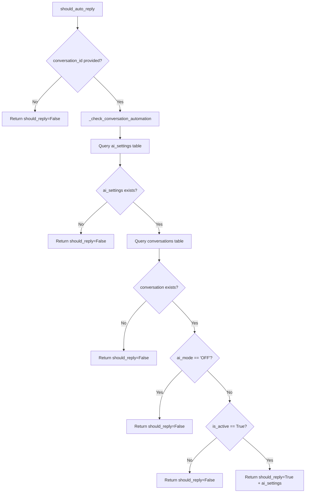
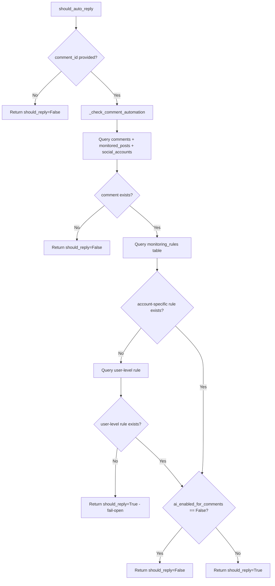
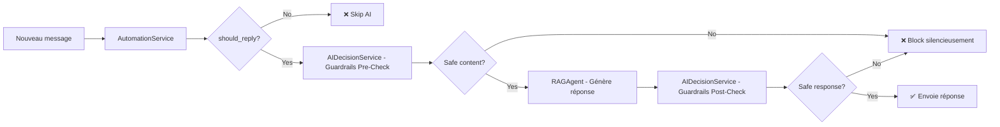

# AutomationService - Architecture Unifiée

**Date:** 2025-10-23
**Version:** 2.0 (Refactorisation)
**Status:** ✅ Production

---

## 📋 Vue d'Ensemble

`AutomationService` est le service centralisé pour vérifier si l'IA doit répondre automatiquement à un message (conversation DM/chat ou commentaire public).

### Rôle
**Gatekeeper on/off basique** - Vérifie si l'utilisateur a activé l'IA pour:
- ✅ Conversations/DMs (WhatsApp, Instagram Direct)
- ✅ Commentaires publics (Instagram posts, Facebook posts)

### Ce qu'il fait
- ✅ Check simple on/off par conversation (ai_mode)
- ✅ Check simple on/off par type de contenu (chats vs comments)
- ✅ Retourne les settings AI pour le RAG Agent

### Ce qu'il NE fait PAS
- ❌ Analyse de contenu (c'est le rôle de `AIDecisionService`)
- ❌ Modération OpenAI (c'est le rôle de `AIDecisionService`)
- ❌ Guardrails personnalisés (c'est le rôle de `AIDecisionService`)

---

## 🔄 Architecture

### Fichier
`/workspace/backend/app/services/automation_service.py`

### Signature
```python
class AutomationService:
    def should_auto_reply(
        user_id: str,
        conversation_id: Optional[str] = None,
        comment_id: Optional[str] = None,
        context_type: Literal["chat", "comment"] = "chat"
    ) -> Dict[str, Any]:
        """
        Returns:
        {
            "should_reply": bool,
            "reason": str,
            "matched_rules": List[str],
            "ai_settings": Dict[str, Any]  # Only for chats
        }
        """
```

---

## 📊 Flux de Décision

### Pour Conversations/DMs (`context_type="chat"`)



### Tables utilisées (Chats)
- `ai_settings` (user_id) → `is_active`, `system_prompt`
- `conversations` (id) → `ai_mode` ('ON' ou 'OFF')

---

### Pour Commentaires (`context_type="comment"`)



### Tables utilisées (Comments)
- `comments` (id) → FK to `monitored_posts`
- `monitored_posts` (id) → FK to `social_accounts`
- `monitoring_rules` (user_id, social_account_id) → `ai_enabled_for_comments`

**Stratégie Fail-Open:**
Si la query `monitoring_rules` échoue → `should_reply=True` (permet le traitement par défaut)

---

## 🔌 Où est-il utilisé ?

### 1. **Batch Scanner** (`batch_scanner.py`)
Traite les messages WhatsApp/Instagram DMs reçus via webhooks.

```python
automation_service = AutomationService()
automation_check = automation_service.should_auto_reply(
    user_id=user_id,
    conversation_id=conversation_id,
    context_type="chat"
)

if not automation_check["should_reply"]:
    return  # Skip AI processing

ai_settings = automation_check["ai_settings"]
# Pass ai_settings to RAGAgent
```

**Ligne:** `batch_scanner.py:181-187`

---

### 2. **Comment Worker** (`workers/comments.py`)
Traite les commentaires Instagram/Facebook.

```python
from app.services.automation_service import AutomationService

automation_service = AutomationService()
automation_check = automation_service.should_auto_reply(
    user_id=user_id,
    comment_id=comment_id,
    context_type="comment"
)

if not automation_check["should_reply"]:
    db.table("comments").update({"triage": "ignore"}).eq("id", comment_id).execute()
    return  # Skip AI processing
```

**Ligne:** `workers/comments.py:438-459`

---

### 3. **Automation Router** (`routers/automation.py`)
API endpoints pour vérifier/toggler l'automation.

**Endpoint 1:** `POST /automation/conversations/{conversation_id}/check`
```python
service = AutomationService()
result = service.should_auto_reply(
    user_id=current_user_id,
    conversation_id=conversation_id,
    context_type="chat"
)
return AutomationCheckResponse(**result)
```

**Endpoint 2:** `PATCH /automation/conversations/{conversation_id}/toggle`
```python
# Toggle ai_mode directly in conversations table
target_mode = "ON" if request.enabled else "OFF"
db.table("conversations").update({"ai_mode": target_mode}).eq("id", conversation_id).execute()
```

**Fichier:** `routers/automation.py:51-72`

---

## 🎯 Différence avec `AIDecisionService`

| Service | Objectif | Scope | Intelligence | Tables |
|---------|----------|-------|--------------|--------|
| **AutomationService** | Switch on/off | Conversation/Comment-level | ❌ Basique | `ai_settings`, `conversations`, `monitoring_rules` |
| **AIDecisionService** | Analyse contenu + guardrails | Message-level | ✅ Avancé | `ai_rules`, `ai_decisions` + OpenAI Moderation API |

### Ordre d'Exécution



**Résumé:**
1. **AutomationService** → "Est-ce que l'IA est activée pour ce contexte ?"
2. **AIDecisionService** → "Est-ce que le CONTENU est safe et approprié ?"
3. **RAGAgent** → "Quelle est la réponse intelligente ?"

---

## 🗑️ Code Mort Supprimé

### `auto_reply_service.py` - OBSOLÈTE ❌
**Raison:** Jamais utilisé (0 imports trouvés dans le codebase)

**Remplacé par:**
- `ai_settings` table + `AutomationService` pour conversations
- `monitoring_rules` table + `AutomationService` pour commentaires

**Migration créée:** `20251023_drop_auto_reply_settings.sql`

---

## ✅ Critères de Validation

### Tests à Effectuer

**A. Conversations/DMs**
```bash
# 1. Désactiver AI pour une conversation (ai_mode='OFF')
PATCH /automation/conversations/{conversation_id}/toggle
{ "enabled": false }

# 2. Envoyer un message WhatsApp
# → Vérifier que AutomationService.should_auto_reply() retourne should_reply=False
# → Vérifier qu'aucune réponse AI n'est générée
```

**B. Commentaires**
```bash
# 1. Désactiver AI pour commentaires dans monitoring_rules
UPDATE monitoring_rules SET ai_enabled_for_comments = FALSE WHERE user_id = '...';

# 2. Poster un commentaire Instagram
# → Vérifier que AutomationService.should_auto_reply() retourne should_reply=False
# → Vérifier que le commentaire est marqué triage='ignore'
```

**C. Vérifier code mort supprimé**
```sql
-- Vérifier que la table auto_reply_settings n'existe plus
SELECT table_name FROM information_schema.tables WHERE table_name = 'auto_reply_settings';
-- → Résultat attendu: 0 rows
```

---

## 📝 Historique des Modifications

### V2.0 (2025-10-23) - Refactorisation Architecture
- ✅ Suppression `auto_reply_service.py` (code mort)
- ✅ `AutomationService` supporte maintenant les commentaires
- ✅ Signature unifiée avec `context_type` parameter
- ✅ Logique DRY (Don't Repeat Yourself) - plus de duplication
- ✅ `workers/comments.py` utilise `AutomationService` au lieu de check direct
- ✅ Migration `20251023_drop_auto_reply_settings.sql`

### V1.0 (2025-10-18) - Version Initiale
- ✅ `AutomationService` pour conversations seulement
- ✅ Check direct dans `workers/comments.py` (duplication)
- ⚠️ `auto_reply_service.py` existait mais jamais utilisé

---

## 🔗 Références

**Code:**
- `/workspace/backend/app/services/automation_service.py` - Service principal
- `/workspace/backend/app/services/batch_scanner.py:181` - Usage pour DMs
- `/workspace/backend/app/workers/comments.py:438` - Usage pour commentaires
- `/workspace/backend/app/routers/automation.py` - API endpoints

**Documentation:**
- `.agent/System/AI_MODERATION_SYSTEM.md` - AIDecisionService (guardrails)
- `.agent/System/comment-monitoring-unified-api.md` - Monitoring comments architecture
- `.agent/System/CELERY_ARCHITECTURE.md` - Workers & tasks

**Migrations:**
- `migrations/20251023_drop_auto_reply_settings.sql` - Drop obsolete table
- `migrations/20251019_create_monitored_posts.sql` - monitoring_rules table

---

*Dernière mise à jour: 2025-10-23 - V2.0 (Refactorisation)*
