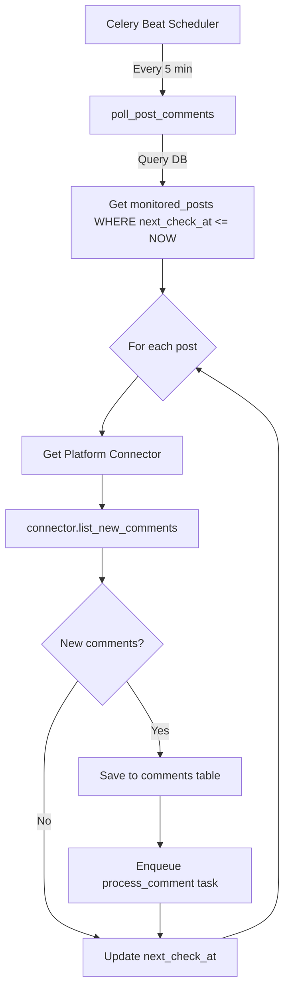
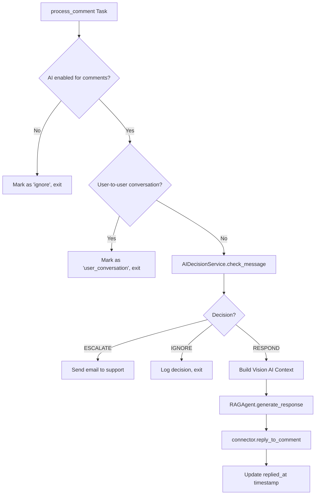

# Comment Monitoring System - Unified API Documentation

**Version:** 1.0
**Last Updated:** 2025-10-20
**Platforms Supported:** Instagram (✅), Facebook (🚧), Twitter (🚧), TikTok (🚧), LinkedIn (🚧)

---

## Table of Contents

1. [Architecture Overview](#architecture-overview)
2. [Core Components](#core-components)
3. [Data Flow](#data-flow)
4. [Platform Abstraction Layer](#platform-abstraction-layer)
5. [API Endpoints](#api-endpoints)
6. [Database Schema](#database-schema)
7. [Integrating New Platforms](#integrating-new-platforms)
8. [AI Context Enrichment](#ai-context-enrichment)
9. [Testing & Debugging](#testing--debugging)

---

## Architecture Overview

### System Design Principles

The comment monitoring system follows a **platform-agnostic** architecture:

```
┌─────────────────────────────────────────────────────────────────┐
│                        Frontend UI Layer                         │
│  (MonitoringRulesPanel, PostSelectionPanel, CommentsList)       │
└──────────────────────┬──────────────────────────────────────────┘
                       │
┌──────────────────────▼──────────────────────────────────────────┐
│                    Backend API Layer                             │
│         (FastAPI routes: /api/monitored-posts/*)                 │
└──────────────────────┬──────────────────────────────────────────┘
                       │
┌──────────────────────▼──────────────────────────────────────────┐
│              Platform Connector Layer (Unified)                  │
│   ┌─────────────┬──────────────┬──────────────┬────────────┐   │
│   │ Instagram   │  Facebook    │   Twitter    │  TikTok    │   │
│   │ Connector   │  Connector   │  Connector   │  Connector │   │
│   └─────────────┴──────────────┴──────────────┴────────────┘   │
└──────────────────────┬──────────────────────────────────────────┘
                       │
┌──────────────────────▼──────────────────────────────────────────┐
│                  Celery Workers (Async)                          │
│   • poll_post_comments (every 5 min)                            │
│   • process_comment (AI triage + auto-reply)                    │
└──────────────────────┬──────────────────────────────────────────┘
                       │
┌──────────────────────▼──────────────────────────────────────────┐
│                    AI Processing Layer                           │
│   • CommentTriageService (conversation detection)               │
│   • RAGAgent (Vision AI + context enrichment)                   │
│   • AIDecisionService (moderation + escalation)                 │
└──────────────────────┬──────────────────────────────────────────┘
                       │
┌──────────────────────▼──────────────────────────────────────────┐
│                  Database (Supabase PostgreSQL)                  │
│   Tables: monitored_posts, comments, social_accounts,           │
│           monitoring_rules, ai_settings                          │
└──────────────────────────────────────────────────────────────────┘
```

---

## Core Components

### 1. **MonitoredPosts Service** (`backend/app/services/monitoring_service.py`)

**Purpose:** Manage posts that are actively monitored for comments.

**Key Methods:**
- `get_monitored_posts(account_id)` - List all monitored posts
- `sync_instagram_posts(account_id, limit)` - Import posts from Instagram
- `toggle_monitoring(post_id, duration_days)` - Enable/disable monitoring

**Example Usage:**
```python
from app.services.monitoring_service import MonitoringService

service = MonitoringService(user_id="user_123", supabase=db)
posts = service.get_monitored_posts(social_account_id="account_456")
```

---

### 2. **Platform Connectors** (Unified Interface)

All platform connectors implement the **same interface**:

```python
class BasePlatformConnector(ABC):
    """Abstract base class for all platform connectors"""

    @abstractmethod
    async def list_new_comments(
        self,
        post_id: str,
        since_cursor: Optional[str] = None
    ) -> Tuple[List[Dict], Optional[str]]:
        """
        Fetch new comments for a post

        Returns:
            (comments, next_cursor)
        """
        pass

    @abstractmethod
    async def reply_to_comment(
        self,
        comment_id: str,
        reply_text: str
    ) -> Dict[str, Any]:
        """
        Reply to a comment

        Returns:
            {"success": bool, "reply_id": str, "error": str}
        """
        pass

    @abstractmethod
    def normalize_comment(self, raw_comment: Dict) -> Dict:
        """
        Convert platform-specific comment format to unified format

        Unified format:
        {
            "id": str,
            "author_name": str,
            "author_id": str,
            "text": str,
            "created_at": str (ISO format),
            "parent_id": Optional[str],
            "like_count": int
        }
        """
        pass
```

---

### 3. **Instagram Connector** (`backend/app/services/instagram_connector.py`)

**Implementation Example:**

```python
class InstagramConnector(BasePlatformConnector):
    def __init__(self, access_token: str, account_id: str):
        self.service = InstagramService(access_token, account_id)

    async def list_new_comments(
        self,
        post_id: str,
        since_cursor: Optional[str] = None
    ) -> Tuple[List[Dict], Optional[str]]:
        """Fetch comments from Instagram Graph API v23.0"""

        url = f"https://graph.facebook.com/v23.0/{post_id}/comments"
        params = {
            'fields': 'id,username,text,timestamp,from,parent_id,like_count',
            'limit': 50,
            'access_token': self.access_token
        }

        if since_cursor:
            params['after'] = since_cursor

        async with httpx.AsyncClient() as client:
            response = await client.get(url, params=params)
            response.raise_for_status()
            data = response.json()

        comments = [self.normalize_comment(c) for c in data.get('data', [])]
        next_cursor = data.get('paging', {}).get('cursors', {}).get('after')

        return comments, next_cursor

    def normalize_comment(self, raw_comment: Dict) -> Dict:
        """Normalize Instagram comment to unified format"""
        return {
            'id': raw_comment['id'],
            'author_name': raw_comment.get('username', 'Unknown'),
            'author_id': raw_comment.get('from', {}).get('id'),
            'text': raw_comment['text'],
            'created_at': raw_comment['timestamp'],
            'parent_id': raw_comment.get('parent_id'),
            'like_count': raw_comment.get('like_count', 0)
        }
```

---

## Data Flow

### Comment Polling Flow



### Comment Processing Flow



---

## Platform Abstraction Layer

### Unified Comment Schema

All comments are stored in a unified format regardless of platform:

```sql
CREATE TABLE comments (
    id UUID PRIMARY KEY DEFAULT uuid_generate_v4(),
    monitored_post_id UUID REFERENCES monitored_posts(id),
    platform_comment_id VARCHAR(255) NOT NULL,
    author_name VARCHAR(255),
    author_id VARCHAR(255),
    author_avatar_url TEXT,
    text TEXT,
    created_at TIMESTAMPTZ,
    parent_id VARCHAR(255),  -- For thread support
    like_count INTEGER DEFAULT 0,
    triage VARCHAR(50) CHECK (triage IN ('respond', 'ignore', 'escalate', 'user_conversation')),
    ai_decision_id UUID,
    replied_at TIMESTAMPTZ,
    ai_reply_text TEXT,
    UNIQUE(monitored_post_id, platform_comment_id)
);
```

### Platform-Specific Extensions

Each platform may have additional metadata stored in `metadata` JSONB column:

**Instagram:**
```json
{
    "media_id": "18012345678901234",
    "media_product_type": "REELS",
    "is_reply_to_story": false
}
```

**Facebook:**
```json
{
    "page_id": "1234567890",
    "post_type": "photo",
    "reactions": {"like": 5, "love": 2}
}
```

**Twitter:**
```json
{
    "tweet_id": "1234567890123456789",
    "is_quote_tweet": false,
    "retweet_count": 10
}
```

---

## API Endpoints

### GET `/api/monitored-posts`

List all monitored posts for a social account.

**Query Parameters:**
- `social_account_id` (optional) - Filter by specific account
- `limit` (optional, default: 50) - Max results
- `offset` (optional, default: 0) - Pagination offset

**Response:**
```json
{
    "posts": [
        {
            "id": "uuid",
            "platform": "instagram",
            "platform_post_id": "18012345678901234",
            "caption": "Check out our new product!",
            "media_url": "https://...",
            "posted_at": "2025-10-20T10:00:00Z",
            "monitoring_enabled": true,
            "monitoring_ends_at": "2025-10-27T10:00:00Z",
            "comments_count": 15,
            "days_remaining": 5
        }
    ],
    "total": 100,
    "limit": 50,
    "offset": 0
}
```

---

### POST `/api/monitored-posts/sync-instagram`

Import and monitor recent Instagram posts.

**Request Body:**
```json
{
    "social_account_id": "account_uuid",  // optional
    "limit": 50
}
```

**Response:**
```json
{
    "success": true,
    "posts_imported": 25,
    "posts_monitored": 5,
    "message": "Successfully imported 25 posts, 5 monitored"
}
```

---

### POST `/api/monitored-posts/{post_id}/toggle-monitoring`

Enable or disable monitoring for a specific post.

**Request Body:**
```json
{
    "duration_days": 7  // optional, defaults to monitoring_rules setting
}
```

**Response:**
```json
{
    "success": true,
    "post": {
        "id": "uuid",
        "monitoring_enabled": true,
        "monitoring_ends_at": "2025-10-27T10:00:00Z"
    },
    "message": "Monitoring enabled for 7 days"
}
```

---

### GET `/api/debug/comments/comment-context/{comment_id}`

**🔧 Debug endpoint** - View exact AI context for a comment.

**Response:**
```json
{
    "success": true,
    "context": {
        "comment": {
            "id": "uuid",
            "text": "How much does this cost?",
            "author_name": "john_doe"
        },
        "post": {
            "caption": "New product launch!",
            "media_url": "https://...",
            "music_title": "Summer Vibes"
        },
        "thread": [
            {"author": "jane_smith", "text": "Looks amazing!"}
        ],
        "ai_context_parts": [
            {"type": "image_url", "image_url": {"url": "https://..."}},
            {"type": "text", "text": "📸 Post Caption: ..."}
        ]
    }
}
```

---

## Database Schema

### Key Tables

#### `monitored_posts`

```sql
CREATE TABLE monitored_posts (
    id UUID PRIMARY KEY,
    user_id UUID REFERENCES users(id),
    social_account_id UUID REFERENCES social_accounts(id),
    platform VARCHAR(50) NOT NULL,
    platform_post_id VARCHAR(255) NOT NULL,
    caption TEXT,
    media_url TEXT,
    music_title VARCHAR(500),  -- 🎵 New: Music title for context
    posted_at TIMESTAMPTZ,
    source VARCHAR(50) CHECK (source IN ('scheduled', 'imported', 'manual')),
    monitoring_enabled BOOLEAN DEFAULT true,
    monitoring_started_at TIMESTAMPTZ,
    monitoring_ends_at TIMESTAMPTZ,
    last_check_at TIMESTAMPTZ,
    next_check_at TIMESTAMPTZ,
    created_at TIMESTAMPTZ DEFAULT NOW(),
    updated_at TIMESTAMPTZ DEFAULT NOW(),
    UNIQUE(platform, platform_post_id)
);
```

#### `monitoring_rules`

```sql
CREATE TABLE monitoring_rules (
    id UUID PRIMARY KEY,
    user_id UUID REFERENCES users(id),
    social_account_id UUID REFERENCES social_accounts(id),  -- NULL = global rules
    auto_monitor_enabled BOOLEAN DEFAULT true,
    auto_monitor_count INTEGER DEFAULT 5 CHECK (auto_monitor_count BETWEEN 1 AND 20),
    monitoring_duration_days INTEGER DEFAULT 7 CHECK (monitoring_duration_days BETWEEN 1 AND 30),
    ai_enabled_for_comments BOOLEAN DEFAULT true,  -- 🔕 Granular AI control
    created_at TIMESTAMPTZ DEFAULT NOW(),
    updated_at TIMESTAMPTZ DEFAULT NOW()
);
```

#### `ai_settings`

```sql
CREATE TABLE ai_settings (
    id UUID PRIMARY KEY,
    user_id UUID REFERENCES users(id),
    ai_model VARCHAR(100) DEFAULT 'openai/gpt-4o',
    temperature DECIMAL(3,2) DEFAULT 0.20,
    system_prompt TEXT,
    is_active BOOLEAN DEFAULT true,
    ai_enabled_for_conversations BOOLEAN DEFAULT true,  -- 🔕 Granular AI control for DMs
    created_at TIMESTAMPTZ DEFAULT NOW(),
    updated_at TIMESTAMPTZ DEFAULT NOW()
);
```

---

## Integrating New Platforms

### Step-by-Step Guide

#### 1. Create Platform Connector

Create a new file: `backend/app/services/{platform}_connector.py`

```python
from typing import List, Dict, Tuple, Optional, Any
import httpx
from .base_connector import BasePlatformConnector

class FacebookConnector(BasePlatformConnector):
    """Facebook Graph API connector for comments"""

    def __init__(self, access_token: str, page_id: str):
        self.access_token = access_token
        self.page_id = page_id
        self.base_url = "https://graph.facebook.com/v23.0"

    async def list_new_comments(
        self,
        post_id: str,
        since_cursor: Optional[str] = None
    ) -> Tuple[List[Dict], Optional[str]]:
        """
        Fetch comments from Facebook Graph API

        API Reference: https://developers.facebook.com/docs/graph-api/reference/post/comments
        """
        url = f"{self.base_url}/{post_id}/comments"
        params = {
            'fields': 'id,from{name,id},message,created_time,parent,like_count',
            'limit': 50,
            'access_token': self.access_token
        }

        if since_cursor:
            params['after'] = since_cursor

        async with httpx.AsyncClient() as client:
            response = await client.get(url, params=params)
            response.raise_for_status()
            data = response.json()

        comments = [self.normalize_comment(c) for c in data.get('data', [])]
        next_cursor = data.get('paging', {}).get('cursors', {}).get('after')

        return comments, next_cursor

    async def reply_to_comment(
        self,
        comment_id: str,
        reply_text: str
    ) -> Dict[str, Any]:
        """
        Reply to a Facebook comment

        API Reference: https://developers.facebook.com/docs/graph-api/reference/comment/comments
        """
        url = f"{self.base_url}/{comment_id}/comments"
        data = {
            'message': reply_text,
            'access_token': self.access_token
        }

        async with httpx.AsyncClient() as client:
            response = await client.post(url, json=data)

            if response.status_code == 200:
                result = response.json()
                return {
                    "success": True,
                    "reply_id": result.get('id'),
                    "error": None
                }
            else:
                return {
                    "success": False,
                    "reply_id": None,
                    "error": response.text
                }

    def normalize_comment(self, raw_comment: Dict) -> Dict:
        """Normalize Facebook comment to unified format"""
        return {
            'id': raw_comment['id'],
            'author_name': raw_comment.get('from', {}).get('name', 'Unknown'),
            'author_id': raw_comment.get('from', {}).get('id'),
            'text': raw_comment.get('message', ''),
            'created_at': raw_comment['created_time'],
            'parent_id': raw_comment.get('parent', {}).get('id'),
            'like_count': raw_comment.get('like_count', 0)
        }
```

---

#### 2. Update Worker to Support New Platform

Modify `backend/app/workers/comments.py`:

```python
def _get_connector(post: Dict[str, Any]) -> Optional[BasePlatformConnector]:
    """Get platform connector for a post"""
    platform = post.get("platform")

    if platform == "instagram":
        # ... existing Instagram code
        return InstagramConnector(access_token, page_id)

    elif platform == "facebook":
        social_accounts = post.get("social_accounts")
        access_token = social_accounts.get("access_token")
        page_id = social_accounts.get("account_id")

        if not access_token or not page_id:
            logger.error(f"Missing credentials for Facebook post {post.get('id')}")
            return None

        return FacebookConnector(access_token, page_id)

    elif platform == "twitter":
        # TODO: Implement TwitterConnector
        pass

    else:
        logger.warning(f"[POLL] Unsupported platform: {platform}")
        return None
```

---

#### 3. Add Platform-Specific OAuth

Update `backend/app/routers/oauth.py`:

```python
@router.get("/facebook/connect")
async def facebook_connect():
    """Initiate Facebook OAuth flow"""
    auth_url = (
        f"https://www.facebook.com/v23.0/dialog/oauth?"
        f"client_id={FACEBOOK_APP_ID}&"
        f"redirect_uri={FACEBOOK_REDIRECT_URI}&"
        f"scope=pages_manage_posts,pages_read_engagement"
    )
    return RedirectResponse(auth_url)

@router.get("/facebook/callback")
async def facebook_callback(code: str, db: Supabase = Depends(get_db)):
    """Handle Facebook OAuth callback"""
    # Exchange code for access_token
    # Save to social_accounts table
    pass
```

---

#### 4. Test Integration

Create test script: `backend/test_facebook_connector.py`

```python
import asyncio
from app.services.facebook_connector import FacebookConnector

async def test_facebook():
    connector = FacebookConnector(
        access_token="TEST_TOKEN",
        page_id="TEST_PAGE_ID"
    )

    # Test fetching comments
    comments, cursor = await connector.list_new_comments("POST_ID_123")
    print(f"✅ Fetched {len(comments)} comments")

    # Test replying
    result = await connector.reply_to_comment("COMMENT_ID_456", "Thank you!")
    print(f"✅ Reply sent: {result}")

if __name__ == "__main__":
    asyncio.run(test_facebook())
```

---

## AI Context Enrichment

### Vision AI Context Builder

The system builds enriched context for each comment, including:

1. **Post Image** (Vision AI) - Actual media from the post
2. **Post Caption** - Original post text
3. **Music Title** - If the post has music (Instagram Reels/Stories)
4. **Comment Thread** - Up to 10 recent comments for context
5. **Current Comment** - The comment being responded to

**Example Context:**

```json
[
    {
        "type": "image_url",
        "image_url": {
            "url": "https://scontent.cdninstagram.com/v/t51.29350-15/..."
        }
    },
    {
        "type": "text",
        "text": "📸 Post Caption: Check out our new summer collection! 🌞\n\n🎵 Music: Dua Lipa - Levitating\n\n💬 Comment Thread:\n  - @sarah_jones: Love the colors!\n  - @mike_wilson: When will this be available?\n  - @owner: @mike_wilson Coming next week!\n\n❓ New Comment from @jessica_brown: How much does the blue dress cost?"
    }
]
```

This enriched context allows the AI to:
- See what the post looks like (Vision AI)
- Understand the conversation flow
- Reference the music/vibe of the content
- Provide contextual, relevant responses

---

## Testing & Debugging

### Debug Endpoints

**Force Poll:**
```bash
curl -X POST http://localhost:8000/api/debug/comments/force-poll \
  -H "Authorization: Bearer YOUR_TOKEN"
```

**View Comment Context:**
```bash
curl http://localhost:8000/api/debug/comments/comment-context/{comment_id} \
  -H "Authorization: Bearer YOUR_TOKEN"
```

**Test Conversation Detection:**
```bash
curl -X POST http://localhost:8000/api/debug/comments/test-should-respond \
  -H "Content-Type: application/json" \
  -d '{
    "comment": {
        "text": "@other_user looks great!",
        "author_name": "john_doe"
    },
    "post": {
        "caption": "New product launch"
    },
    "owner_username": "my_brand"
  }'
```

### Monitoring Logs

**Check Celery worker logs:**
```bash
tail -f /var/log/celery/worker.log | grep "\\[POLL\\]\\|\\[PROCESS\\]"
```

**Key log patterns:**
- `[POLL] Checking X monitored posts` - Polling started
- `[POLL] Post {id}: found X new comments` - Comments discovered
- `[PROCESS] AI disabled for comments` - AI control flag triggered
- `[PROCESS] Skipping AI processing: user_conversation` - Conversation detection
- `[PROCESS] Added post image to context` - Vision AI context built

---

## Platform Comparison

| Platform   | Comments API | Reply API | Media Support | Music Metadata | OAuth Scope |
|------------|--------------|-----------|---------------|----------------|-------------|
| Instagram  | ✅ Graph v23 | ✅        | ✅ Images     | ⚠️ Limited    | `instagram_manage_comments` |
| Facebook   | ✅ Graph v23 | ✅        | ✅ Images+Video | ❌ No       | `pages_manage_posts` |
| Twitter    | ✅ API v2    | ✅        | ✅ Images+GIFs | ❌ No       | `tweet.read`, `tweet.write` |
| TikTok     | 🚧 API v2    | 🚧        | ✅ Videos     | ✅ Yes       | `video.list`, `comment.list` |
| LinkedIn   | ⚠️ Limited   | ⚠️        | ✅ Images     | ❌ No       | `w_organization_social` |

---

## Next Steps

1. ✅ **Instagram** - Fully implemented with Vision AI
2. 🚧 **Facebook** - Connector template ready (needs OAuth)
3. 🚧 **Twitter** - API v2 integration needed
4. 🚧 **TikTok** - Beta API access required
5. 🚧 **LinkedIn** - Limited comment API capabilities

---

## Support & References

- **Instagram API Docs:** https://developers.facebook.com/docs/instagram-basic-display-api
- **Facebook Graph API:** https://developers.facebook.com/docs/graph-api
- **Twitter API v2:** https://developer.twitter.com/en/docs/twitter-api
- **TikTok API:** https://developers.tiktok.com/doc/

---

**Maintained by:** Engineering Team
**Questions?** Contact: dev@company.com
