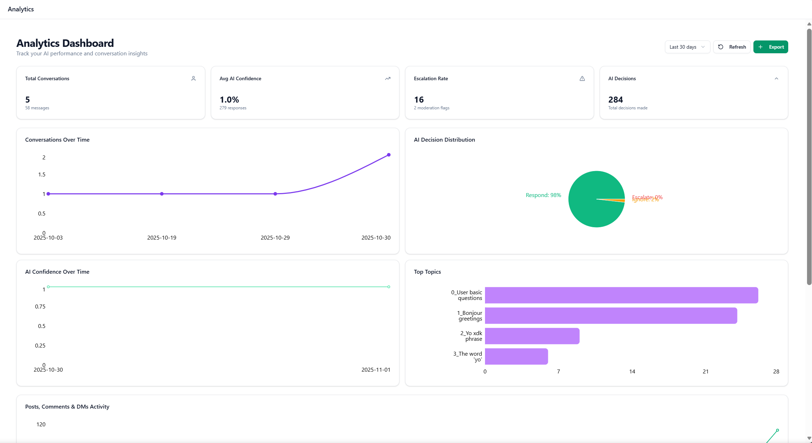
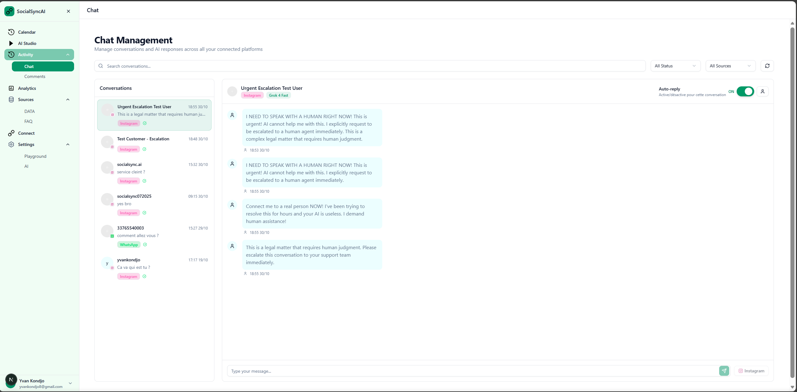
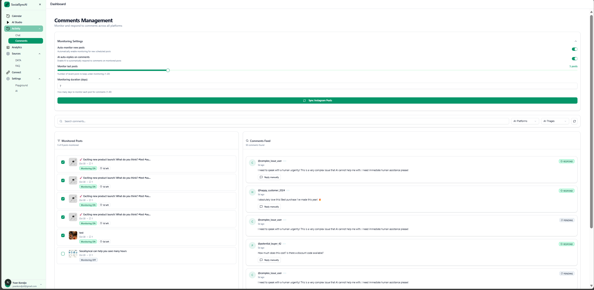
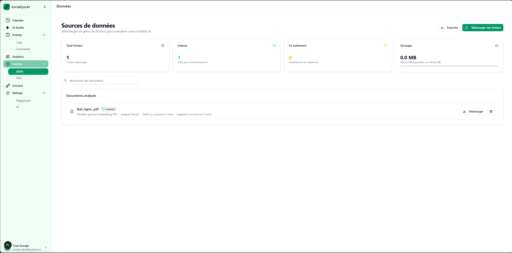
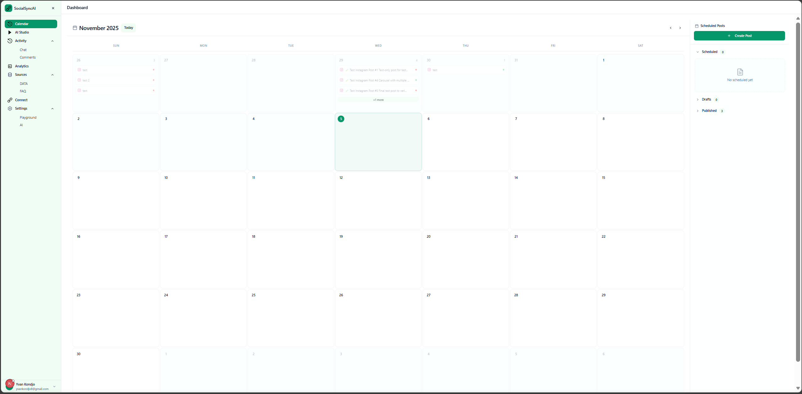

# 🤖 SocialSync AI - Open Source Edition

**AI-Powered Social Media Management & Automation Platform**

[](https://www.gnu.org/licenses/agpl-3.0)
[](https://www.python.org/downloads/)
[](https://nextjs.org/)
[](https://docker.com/)

---

<table>
  <tr>
    <td></td>
    <td></td>
  </tr>
  <tr>
    <td align="center"><b>📊 Real-time Analytics</b></td>
    <td align="center"><b>💬 Unified Inbox</b></td>
  </tr>
</table>

**SocialSync AI** is an open-source platform for intelligent social media management. Automate responses, manage messages and comments, and create content with AI assistance across Instagram and WhatsApp Business.

> **✨ Key Highlights:**
>
> - 🤖 AI-powered conversation automation
> - 📊 Real-time analytics and insights
> - 🎨 Content creation studio
> - 🔄 Unified inbox for all platforms
> - 📚 Knowledge base with RAG technology
> - 📅 Smart scheduling system

---

## ✨ Features

### 🤖 AI Automation

- **Automatic responses** to Instagram DMs and WhatsApp messages
- **Sentiment analysis** and intelligent conversation triage
- **Customizable rules** to control when AI responds
- **Safety mode** with configurable guardrails

### 💬 Conversation Management


- **Unified inbox** for Instagram DMs and WhatsApp Business
- **Manual or AI-assisted** responses
- **Escalation** for important conversations
- **Complete history** of exchanges

### 📝 Instagram Comments



- **Automatic monitoring** of comments on your posts
- **Contextual AI responses** based on your knowledge base
- **Filter rules** to ignore certain types of comments
- **Management dashboard** with statistics

### 📚 Knowledge Base



- **FAQ documents** to train the AI
- **RAG (Retrieval Augmented Generation)** for accurate responses
- **Automatic topic modeling** with BERTopic
- **Multi-format support** (text, PDF, etc.)

### 📅 Post Scheduling



- **Publishing calendar** for Instagram
- **Drafts and previews**
- **Multi-post scheduling**
- **Media management**

### 🎨 AI Studio

- **AI-assisted content generation**
- **Text rewriting and improvement**
- **Hashtag suggestions**
- **Customizable tone**

### 📊 Analytics


- **Real-time engagement statistics**
- **Post and comment performance**
- **Conversation metrics**
- **AI usage reports**

## 🚀 Quick Start

### Prerequisites

- ✅ **Docker** and **Docker Compose**
- ✅ **Supabase account** (free) - [supabase.com](https://supabase.com)
- ✅ **API Keys**:
  - OpenRouter or OpenAI (for AI)
  - Meta Developer Account (for Instagram/WhatsApp)
  - Google Gemini (optional, for embeddings)

---

### Installation

#### 1. Clone & Setup

```bash
git clone https://github.com/yvankondjo/socialsync-ai.git
cd socialsync-ai

# Copy environment files
cp backend/.env.example backend/.env
cp frontend/.env.example frontend/.env.local
```

#### 2. Configure Environment Variables


```bash
# Edit backend/.env and frontend/.env.local with your API keys
# Required: SUPABASE_URL, SUPABASE_SERVICE_ROLE_KEY, OPENROUTER_API_KEY
```

#### 3. Launch with Docker

```bash
docker-compose up -d

# Check all services are running
docker-compose ps
```

#### 4. Seed Test Data

```bash
# Configure Supabase credentials
export SUPABASE_URL="https://your-project.supabase.co"
export SUPABASE_SERVICE_ROLE_KEY="your-service-role-key"

# Create test users
python scripts/seed_users.py

# Create test social accounts
python scripts/seed_social_accounts.py
```

#### 5. Access the Application

- 🌐 **Frontend**: [http://localhost:3000](http://localhost:3000)
- 🔌 **API**: [http://localhost:8000](http://localhost:8000)
- 📚 **API Docs**: [http://localhost:8000/docs](http://localhost:8000/docs)

---

### First Steps After Installation

1. **Login** with seed credentials (`demo@socialsync.ai` / `Demo123456!`)
2. **Connect Social Accounts** via Settings → Social Accounts
3. **Upload Knowledge Base** documents for AI training
4. **Configure AI Settings** and guardrails
5. **Test AI responses** in the inbox

📖 **Complete Installation Guide**: [docs/INSTALLATION.md](docs/INSTALLATION.md)

## 📁 Project Structure

```
socialsync-ai/
├── 📁 backend/              # FastAPI API Server
│   ├── app/
│   │   ├── routers/         # REST API endpoints
│   │   ├── services/        # Business logic layer
│   │   ├── workers/         # Celery background tasks
│   │   ├── schemas/         # Pydantic data models
│   │   └── db/             # Database connections
│   └── requirements.txt
├── 📁 frontend/            # Next.js 14 Application
│   ├── app/                # App Router (pages & API routes)
│   ├── components/         # React components library
│   ├── lib/               # Utilities & configurations
│   └── package.json
├── 📁 supabase/           # Database & Auth
│   └── migrations/        # Database schema migrations
├── 📁 scripts/           # Development utilities
│   ├── seed_users.py      # Create test users
│   └── seed_social_accounts.py # Create test social accounts
├── 📁 docs/              # Documentation
│   ├── images/           # Screenshots & diagrams
│   └── *.md              # Feature & setup guides
├── docker-compose.yml    # Container orchestration
└── README.md
```

## 🛠️ Tech Stack

### Backend Architecture

- **FastAPI** - High-performance async API framework
- **Python 3.10+** - Type-safe, modern Python
- **Celery** - Distributed task queue for background jobs
- **Redis** - High-speed caching and message broker
- **Supabase** - PostgreSQL with real-time subscriptions

### Frontend Architecture

- **Next.js 14** - Full-stack React framework with App Router
- **TypeScript** - Type-safe JavaScript with excellent DX
- **Tailwind CSS** - Utility-first CSS framework
- **shadcn/ui** - Accessible, customizable component library
- **Zustand** - Lightweight, scalable state management

### AI & Machine Learning

- **LangChain** - Framework for LLM-powered applications
- **LangGraph** - Stateful orchestration for complex AI workflows
- **OpenRouter** - Unified API for 100+ LLM providers
- **Google Gemini** - Advanced embedding models
- **BERTopic** - Neural topic modeling for document clustering
- **pg_vector** - PostgreSQL vector extension for semantic search

### Infrastructure & DevOps

- **Docker** - Containerization for consistent environments
- **PostgreSQL** - ACID-compliant relational database
- **Redis** - In-memory data structure store
- **Supabase** - Backend-as-a-Service with auth & real-time
- **Celery Beat** - Scheduled task management

## 🔧 Configuration

### Environment Variables

#### Backend Configuration

```bash
# 🔐 Supabase (Required)
SUPABASE_URL=https://your-project.supabase.co
SUPABASE_ANON_KEY=your-anon-key
SUPABASE_SERVICE_ROLE_KEY=your-service-role-key

# 🤖 AI Models (Choose one)
OPENROUTER_API_KEY=sk-or-v1-xxxxx
OPENAI_API_KEY=sk-proj-xxxxx

# 📱 Meta Platforms (Instagram/WhatsApp)
INSTAGRAM_CLIENT_ID=123456789
INSTAGRAM_CLIENT_SECRET=your-secret
WHATSAPP_ACCESS_TOKEN=EAAG...
WHATSAPP_PHONE_NUMBER_ID=123456789

# ⚡ Redis & Caching
REDIS_URL=redis://redis:6379/0

# 🧠 Embeddings (Optional)
GOOGLE_API_KEY=your-gemini-key
```

#### Frontend Configuration

```bash
NEXT_PUBLIC_SUPABASE_URL=https://your-project.supabase.co
NEXT_PUBLIC_SUPABASE_ANON_KEY=your-anon-key
NEXT_PUBLIC_API_URL=http://localhost:8000
```

📖 **Complete Configuration Guide**: [docs/INSTALLATION.md](docs/INSTALLATION.md)

## 📚 Documentation

- **[docs/INSTALLATION.md](docs/INSTALLATION.md)** - Complete setup guide
- **[docs/ARCHITECTURE.md](docs/ARCHITECTURE.md)** - System architecture
- **[docs/DATABASE.md](docs/DATABASE.md)** - Database schema
- **[docs/features/](docs/features/)** - Feature documentation
- **[docs/technical/](docs/technical/)** - Technical deep dives
- **[docs/CONTRIBUTING.md](docs/CONTRIBUTING.md)** - Contribution guide

## 🤝 Contributing

Contributions are welcome! SocialSync AI is licensed under **AGPL v3** - any modifications must be shared with the community.

### How to contribute?

1. **Fork** the project
2. **Create a branch**: `git checkout -b feature/amazing-feature`
3. **Commit**: `git commit -m 'feat: add amazing feature'`
4. **Push**: `git push origin feature/amazing-feature`
5. **Open a Pull Request**

### Code standards

- **Backend**: Follow PEP 8, use Black for formatting
- **Frontend**: ESLint + Prettier configured
- **Commits**: Conventional Commits convention

## 📝 License

This project is licensed under **GNU Affero General Public License v3.0 (AGPL-3.0)**.

**What this means:**

- ✅ You can use, modify, and distribute this code
- ✅ You can use it commercially
- ⚠️ **Any modifications must be shared** under the same license
- ⚠️ If you host a modified version, you must **share the source code**

The AGPL license ensures that SocialSync AI remains open-source forever.

## 🎯 Roadmap

- [ ] Facebook Pages support
- [ ] Twitter/X support
- [ ] LinkedIn support
- [ ] Custom webhooks
- [ ] Plugin marketplace
- [ ] Multi-tenant support
- [ ] Admin interface
- [ ] Advanced analytics reports

## 🐛 Support & Issues

- **Bugs**: [Open an issue](https://github.com/yvankondjo/socialsync-ai/issues)
- **Questions**: [Discussions](https://github.com/yvankondjo/socialsync-ai/discussions)
- **Security**: security@yourdomain.com

## 🌟 Acknowledgments

- **FastAPI** for the excellent framework
- **Next.js** for the Developer Experience
- **Supabase** for the BaaS
- **LangChain** for LLM orchestration
- **shadcn/ui** for the components

## ⭐ Star the Project

If SocialSync AI is useful to you, give us a ⭐ on GitHub!

---

**Made with ❤️ by the open-source community**

_Open-Source Version • Unlimited Credits • AGPL v3 License_
