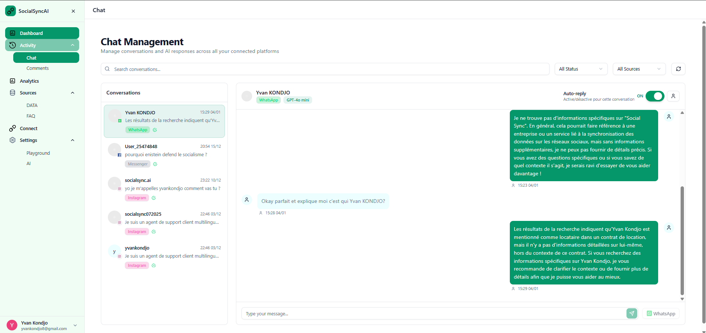
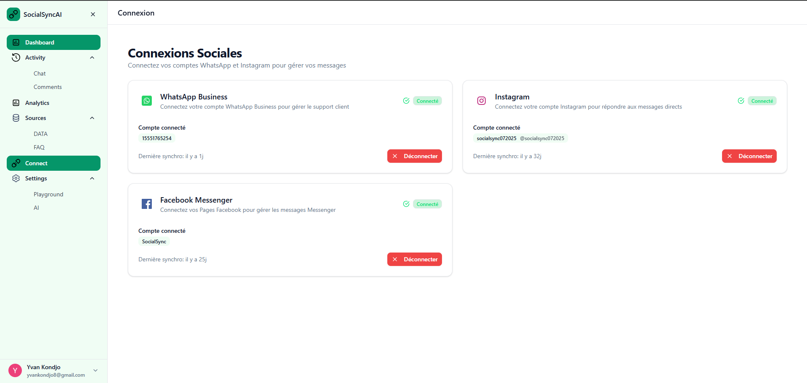
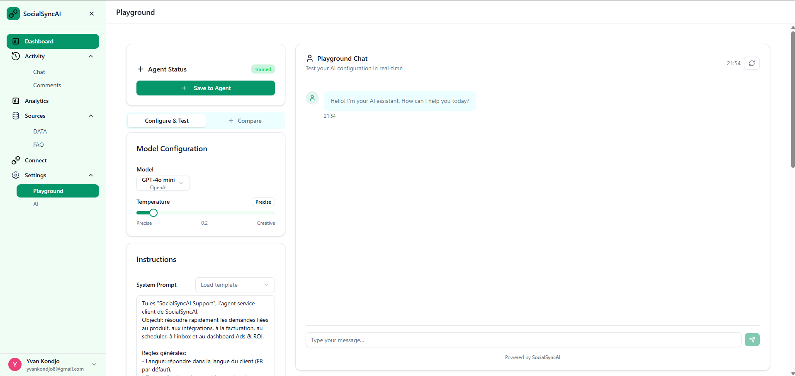

# SocialSync AI

> **Automate Instagram DMs, WhatsApp messages, and comment moderation using AI agents.**

[](LICENSE)
[](https://www.python.org/downloads/)
[](https://nextjs.org/)

SocialSync AI helps businesses automate social media customer support across Instagram, WhatsApp, and Messenger using AI-powered agents with knowledge base integration.

---

## 🎥 Demo Video

<div align="center">

https://github.com/user-attachments/assets/ab161a0a-821e-4aa2-ade4-f8633ca9c85b
  
</div>

---

## Table of Contents

- [Why SocialSync AI?](#why-socialsync-ai)
- [Features](#features)
- [Quick Start](#quick-start)
- [Documentation](#documentation)
- [Tech Stack](#tech-stack)
- [Contributing](#contributing)
- [Screenshots](#screenshots)
- [License](#license)

---

## Why SocialSync AI?

Social media messages and comments require constant monitoring and quick responses.

**SocialSync AI automates this workflow:** AI agents respond to customer inquiries 24/7 using your knowledge base, while escalating complex cases to human support.

**Key benefits:**
- **Unified Inbox**: Manage Instagram DMs, WhatsApp chats, and Messenger conversations in one place
- **AI Automation**: Train AI agents on your business knowledge base for accurate, context-aware responses
- **Smart Escalation**: Automatically routes complex queries to human agents when confidence is low
- **Real-time**: Webhooks deliver messages instantly, with responses sent in under 2 seconds

---

## Features

### 🤖 AI-Powered Automation
- **RAG-based responses**: AI agents use retrieval-augmented generation to answer questions from your knowledge base
- **Multi-model support**: Works with OpenAI, Anthropic, Google Gemini, and OpenRouter
- **Confidence scoring**: Automatically escalates low-confidence responses to human review

### 💬 Unified Inbox
- **Cross-platform messaging**: Instagram DMs, WhatsApp Business API, and Messenger in one interface
- **Real-time sync**: Webhooks deliver new messages instantly
- **Conversation history**: Full message history with metadata and analytics

### 📚 Knowledge Base
- **Document ingestion**: Upload PDFs, text files, or paste content directly
- **Vector search**: Fast semantic search using PostgreSQL pgvector
- **FAQ management**: Create and manage frequently asked questions

### � Comment Monitoring
- **Auto-moderation**: Automatically monitor and respond to Instagram comments
- **Smart triage**: AI determines which comments need responses
- **Import posts**: Import existing Instagram posts for monitoring

### 📊 Analytics Dashboard
- **Response metrics**: Track AI response rate, escalation rate, and response time
- **Conversation insights**: Monitor message volume, sentiment, and engagement
- **Performance tracking**: Daily, weekly, and monthly analytics reports

---

## Quick Start

**Prerequisites:** Docker and Docker Compose installed on your machine.

```bash
# Clone the repository
git clone https://github.com/YOUR_USERNAME/SocialSyncAI.git
cd SocialSyncAI

# Copy environment files
cp backend/.env.example backend/.env
cp frontend/.env.example frontend/.env

# Start all services (backend, frontend, Redis, Celery workers)
docker-compose up --build
```

**Set up the database:**

```bash
# Install Supabase CLI
npm install -g supabase

# Link to your Supabase project (create one at supabase.com first)
npx supabase link --project-ref <your-project-id>

# Apply all database migrations
npx supabase db push
```

**Open your browser:**
- Frontend: http://localhost:3000
- Backend API: http://localhost:8000
- API Documentation: http://localhost:8000/docs

**Next steps:** See [Getting Started Guide](docs/getting-started/quick-start.md) for detailed setup including Supabase credentials, Meta platforms, and AI provider configuration.

---

## Documentation

**Full documentation is available in the [`docs/`](docs/) directory.**

### Essential Guides
- [Getting Started](docs/getting-started/quick-start.md) - Complete setup guide (15 minutes)
- [Environment Variables](docs/getting-started/environment-variables.md) - All configuration options explained
- [Supabase Setup](docs/configuration/supabase.md) - Database and authentication configuration
- [Meta Platforms Setup](docs/configuration/meta-platforms.md) - Instagram, WhatsApp, Messenger OAuth
- [Webhooks Configuration](docs/configuration/webhooks.md) - Real-time event delivery setup

### Architecture
- [System Overview](docs/architecture/overview.md) - High-level architecture and data flow
- [Database Schema](docs/architecture/database-schema.md) - Complete PostgreSQL table structure

---

## Tech Stack

**Frontend**
- **Next.js 14** (App Router) - React framework with server components
- **TypeScript** - Type-safe JavaScript
- **Tailwind CSS** + shadcn/ui - Styling and component library
- **Supabase Auth** - JWT-based authentication

**Backend**
- **FastAPI** - Python async web framework
- **Celery** - Distributed task queue for background jobs
- **Redis** - Message broker and caching layer
- **LangChain** + LangGraph - AI agent orchestration

**Database**
- **PostgreSQL** (via Supabase) - Primary database
- **pgvector** - Vector similarity search for embeddings

**Infrastructure**
- **Docker** + Docker Compose - Containerization
- **Meta Graph API** - Instagram, WhatsApp, Messenger integration
- **Stripe** - Payment processing (optional)

---

## Contributing

We welcome contributions from the community!

**Before contributing:**
1. Read the [Contributing Guide](CONTRIBUTING.md)
2. Check [open issues](https://github.com/YOUR_USERNAME/SocialSyncAI/issues)
3. Fork the repository and create a feature branch

**Areas where we need help:**
- Additional social platform integrations (Twitter/X, LinkedIn, TikTok)
- Multi-language support (currently English-only)
- Advanced analytics features
- Documentation improvements

---

## Screenshots

### Dashboard Overview
<div align="center">
  
  <p><i>Real-time chat interface with AI-powered responses</i></p>
</div>

### Platform Connections
<div align="center">
  
  <p><i>Connect Instagram, WhatsApp, and Messenger accounts</i></p>
</div>

### AI Settings
<div align="center">
  
  <p><i>Test your AI agent before deployment</i></p>
</div>

---

## License

This project is licensed under the **MIT License**.

You are free to use, modify, and distribute this software for commercial or non-commercial purposes. See the [LICENSE](LICENSE) file for full details.

---

## Support

**Need help?**
- 📖 Read the [full documentation](docs/)
- 🐛 Report bugs via [GitHub Issues](https://github.com/YOUR_USERNAME/SocialSyncAI/issues)
- 💬 Join discussions in [GitHub Discussions](https://github.com/YOUR_USERNAME/SocialSyncAI/discussions)

**Built with ❤️ by the open source community.**
