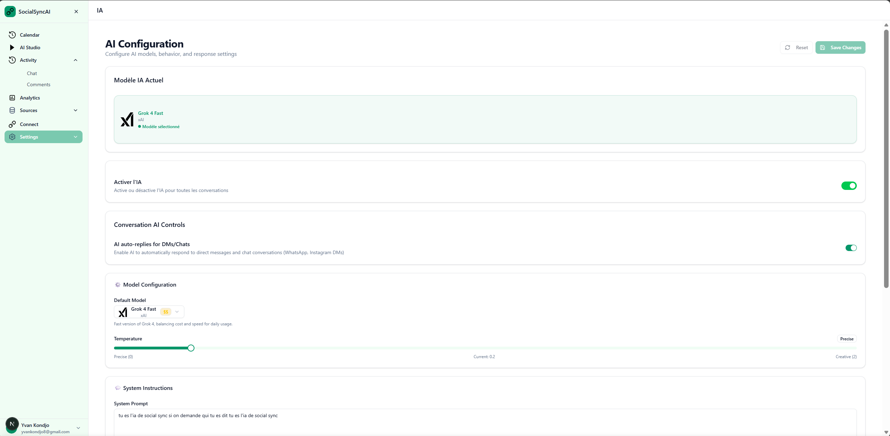
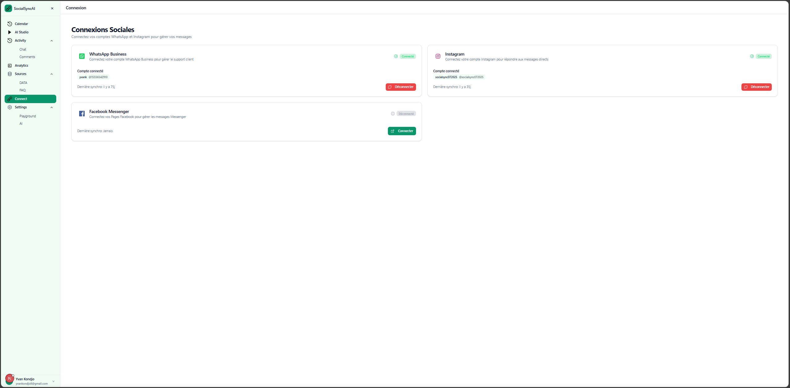

# 🌱 Seeding Guide - SocialSync AI

**Create test data to quickly start developing with SocialSync AI**

[](https://www.gnu.org/licenses/agpl-3.0)
[](https://www.python.org/downloads/)

---

## 📋 Quick Overview

This guide shows you how to populate your SocialSync AI database with test users and social media accounts for development and testing.

**What you'll create:**

- ✅ 3 test users with unlimited credits
- ✅ Fake Instagram & WhatsApp accounts
- ✅ Ready-to-use demo environment

---

## ⚡ Prerequisites

### Required Setup

- ✅ **Supabase project** configured and active
- ✅ **Environment variables** set up
- ✅ **Python 3.10+** installed
- ✅ **Backend dependencies** installed

```bash
# Install Python dependencies
cd backend
pip install -r requirements.txt
```

### Environment Configuration



Configure your environment variables before running scripts:

```bash
# Set your Supabase credentials
export SUPABASE_URL="https://your-project.supabase.co"
export SUPABASE_SERVICE_ROLE_KEY="your-service-role-key"
```

**🔍 Finding Your Supabase Credentials:**

1. Go to [supabase.com](https://supabase.com/dashboard)
2. Select your project
3. Navigate to **Settings** → **API**
4. Copy the following values:
   - **Project URL** → `SUPABASE_URL`
   - **service_role secret** → `SUPABASE_SERVICE_ROLE_KEY`
   - ⚠️ **Never share your service role key!**

## 🚀 Step 1: Create Test Users

The `seed_users.py` script creates test users with unlimited AI credits for development.

### Run the User Seeding Script

```bash
# From the project root directory
python scripts/seed_users.py
```

### What Gets Created

- ✅ **3 Test Users** with unique credentials
- ✅ **Unlimited AI Credits** (999,999 tokens each)
- ✅ **Auto-confirmed Emails** (ready to login)
- ✅ **Test Metadata** for easy identification

### Expected Output

```
======================================================================
  SOCIALSYNC AI - SEED USERS (Open-Source)
======================================================================

📧 Processing user: demo@socialsync.ai
   ✅ User created (ID: abc-123-def-456)
   ✅ Credits created (unlimited)

📧 Processing user: test@socialsync.ai
   ✅ User created (ID: def-456-ghi-789)
   ✅ Credits created (unlimited)

📧 Processing user: admin@socialsync.ai
   ✅ User created (ID: ghi-789-jkl-012)
   ✅ Credits created (unlimited)

📝 Login credentials:
  • Email: demo@socialsync.ai
    Password: Demo123456!
    User ID: abc-123-def-456

  • Email: test@socialsync.ai
    Password: Test123456!
    User ID: def-456-ghi-789

  • Email: admin@socialsync.ai
    Password: Admin123456!
    User ID: ghi-789-jkl-012

======================================================================
  Seeding completed successfully!
  Use the credentials above to log into the platform.
======================================================================
```

## 📱 Step 2: Create Test Social Accounts



The `seed_social_accounts.py` script creates fake social media accounts for testing AI automation features.

### Run the Social Accounts Seeding Script

```bash
# From the project root directory
python scripts/seed_social_accounts.py
```

### Interactive Setup

The script will prompt you to select which user to create accounts for:

```
📧 User email for social accounts (default: demo@socialsync.ai): [Enter]
🔍 Finding user: demo@socialsync.ai
✅ User found (ID: abc-123-def-456)
```

### What Gets Created

- ✅ **Instagram Test Account** with fake credentials
- ✅ **WhatsApp Business Test Account** with fake tokens
- ✅ **Test Metadata** marking accounts as non-production
- ⚠️ **Fake API Tokens** (safe for development only)

### Expected Output

```
======================================================================
  SOCIALSYNC AI - SEED SOCIAL ACCOUNTS (Open-Source)
======================================================================

📧 User email for social accounts (default: demo@socialsync.ai): demo@socialsync.ai
🔍 Finding user: demo@socialsync.ai
✅ User found (ID: abc-123-def-456)

Creating test social accounts...

📱 Creating INSTAGRAM account...
   ✅ Instagram account created (ID: xyz-456-uvw-999)

📱 Creating WHATSAPP account...
   ✅ WhatsApp account created (ID: uvw-999-xyz-111)

📱 Accounts created:
  • INSTAGRAM: demo_instagram (ID: xyz-456-uvw-999)
  • WHATSAPP: +1234567890 (ID: uvw-999-xyz-111)

⚠️  WARNING: These are TEST accounts with fake tokens!
   They will NOT work with real social media APIs.
   For production use, connect real accounts via the dashboard.

======================================================================
  Seeding completed successfully!
  Use these accounts for testing the platform.
======================================================================
```

## ⚙️ Customization & Advanced Usage

### Customize Test Users

Edit `scripts/seed_users.py` to add your own test accounts:

```python
TEST_USERS = [
    {
        "email": "demo@socialsync.ai",
        "password": "Demo123456!",
        "full_name": "Demo User",
        "username": "demo_user"
    },
    {
        "email": "your-email@example.com",
        "password": "YourSecurePassword123!",
        "full_name": "Your Name",
        "username": "your_username"
    }
]
```

**Password Requirements:**

- Minimum 8 characters
- At least one uppercase letter
- At least one number

### Customize Test Social Accounts

Edit `scripts/seed_social_accounts.py` to modify account details:

```python
TEST_SOCIAL_ACCOUNTS = [
    {
        "platform": "instagram",
        "username": "your_instagram_handle",
        "display_name": "Your Instagram Account",
        "access_token": "fake_token_for_testing_only",
        "platform_user_id": "your_fake_user_id",
        "is_test_account": True
    },
    {
        "platform": "whatsapp",
        "username": "+1234567890",
        "display_name": "Your WhatsApp Business",
        "access_token": "fake_whatsapp_token",
        "platform_user_id": "your_fake_wa_id",
        "phone_number": "+1234567890",
        "is_test_account": True
    }
]
```

### Bulk User Creation

For creating many test users, you can modify the script to read from a CSV file or generate users programmatically.

## 🔗 Connecting Real Social Accounts

**Test accounts are for development only.** For production use, connect real social media accounts.

---

## Method 1: Via Dashboard (Recommended)


### Step-by-Step Guide

1. **Start the Application**

   ```bash
   docker-compose up -d
   ```

2. **Access the Dashboard**

   - Open [http://localhost:3000](http://localhost:3000)
   - Login with seed credentials (`demo@socialsync.ai` / `Demo123456!`)

3. **Navigate to Social Accounts**

   - Click **Settings** in the sidebar
   - Select **Social Accounts** tab

4. **Connect Instagram**

   - Click **"Connect Instagram"**
   - Follow Meta's OAuth flow
   - Grant required permissions
   - Authorize the application

5. **Connect WhatsApp Business**
   - Click **"Connect WhatsApp"**
   - Select your WhatsApp Business Account
   - Complete Meta's verification process

### Required Permissions

**Instagram:**

- `instagram_basic` - Basic profile information
- `instagram_manage_messages` - Read/send DMs
- `instagram_manage_comments` - Read/respond to comments

**WhatsApp:**

- `whatsapp_business_messaging` - Send/receive messages
- `whatsapp_business_management` - Manage business account

---

## Method 2: Manual Configuration

For advanced users who prefer direct database management:

### Via Supabase Dashboard

1. **Access Supabase**

   - Go to [supabase.com/dashboard](https://supabase.com/dashboard)
   - Open your project

2. **Navigate to Table Editor**

   - Click **Table Editor** in sidebar
   - Find `social_accounts` table

3. **Create New Record**
   ```sql
   INSERT INTO social_accounts (
     user_id,
     platform,
     username,
     display_name,
     access_token,
     platform_user_id,
     is_test_account
   ) VALUES (
     'your-user-id-here',
     'instagram', -- or 'whatsapp'
     'your_username',
     'Your Display Name',
     'your-real-access-token',
     'platform-user-id',
     false -- NOT a test account
   );
   ```

### Required Fields

| Field              | Instagram     | WhatsApp          | Description                |
| ------------------ | ------------- | ----------------- | -------------------------- |
| `user_id`          | ✅            | ✅                | Your SocialSync user ID    |
| `platform`         | `"instagram"` | `"whatsapp"`      | Platform identifier        |
| `username`         | `@handle`     | `+1234567890`     | Account identifier         |
| `display_name`     | `"Your Name"` | `"Business Name"` | Human-readable name        |
| `access_token`     | ✅            | ✅                | Valid API token            |
| `platform_user_id` | ✅            | ✅                | Platform's user/account ID |
| `is_test_account`  | `false`       | `false`           | Mark as production account |

## 🔧 Troubleshooting

### Common Issues & Solutions

#### ❌ "SUPABASE_URL not configured"

```bash
# Set the required environment variables
export SUPABASE_URL="https://your-project.supabase.co"
export SUPABASE_SERVICE_ROLE_KEY="your-service-role-key"

# Verify they're set
echo $SUPABASE_URL
```

#### ❌ "User already exists"

**This is normal behavior!** The script automatically detects existing users and skips them. No action needed.

#### ❌ "Table 'social_accounts' does not exist"

Run database migrations first:

```bash
# If using Supabase CLI
cd supabase
supabase db push

# Or run migrations via Docker
docker-compose exec backend python -m app.db.migrate
```

#### ❌ "Permission denied" or "RLS policy violation"

- Ensure you're using the **`service_role` key**, not the `anon` key
- The service role key bypasses Row Level Security for admin operations
- Check your Supabase dashboard → Settings → API for the correct key

#### ❌ "Python module not found"

```bash
# Install backend dependencies
cd backend
pip install -r requirements.txt

# Or using Docker
docker-compose exec backend pip install -r requirements.txt
```

#### ❌ "Connection refused" or "Redis connection failed"

```bash
# Check if Redis is running
docker-compose ps redis

# Restart Redis if needed
docker-compose restart redis
```

### Debug Mode

Enable verbose logging to troubleshoot issues:

```bash
# Run scripts with debug output
PYTHONPATH=backend python -c "
import logging
logging.basicConfig(level=logging.DEBUG)
import scripts.seed_users
"
```

---

## 🔒 Security Best Practices

⚠️ **CRITICAL SECURITY NOTES:**

- **🔐 Never commit** real Supabase keys to Git
- **🔐 Never share** your `SUPABASE_SERVICE_ROLE_KEY` publicly
- **🏷️ Test accounts** are clearly marked with `is_test_account: true`
- **🔄 Production accounts** should use real OAuth tokens only
- **🗑️ Clean up** test data before going to production

**Environment Variable Security:**

- Use `.env` files (add to `.gitignore`)
- Never hardcode credentials in scripts
- Rotate keys regularly in production

---

## 🧹 Cleanup & Reset

### Remove Test Data

To delete all test accounts and data:

```sql
-- Run in Supabase SQL Editor or via psql
-- WARNING: This permanently deletes test data!

-- Delete test social accounts
DELETE FROM social_accounts
WHERE metadata->>'is_test_account' = 'true';

-- Delete test user credits
DELETE FROM user_credits
WHERE user_id IN (
  SELECT id FROM auth.users
  WHERE email LIKE '%@socialsync.ai'
);

-- Delete test users (CAUTION: This removes auth.users records)
-- DELETE FROM auth.users WHERE email LIKE '%@socialsync.ai';
```

### Reset Entire Database

For a complete fresh start:

```bash
# Stop all services
docker-compose down -v

# Restart Supabase (if using local)
supabase stop
supabase start

# Re-run migrations
docker-compose exec backend python -m app.db.migrate

# Re-seed data
python scripts/seed_users.py
python scripts/seed_social_accounts.py
```

---

## 🚀 Next Steps After Seeding

Once your database is seeded with test data:

### 1. Start the Application

```bash
docker-compose up -d
docker-compose logs -f  # Monitor startup
```

### 2. Access the Dashboard

- 🌐 **Frontend**: [http://localhost:3000](http://localhost:3000)
- 🔌 **API Docs**: [http://localhost:8000/docs](http://localhost:8000/docs)

### 3. Login & Explore

- **Username**: `demo@socialsync.ai`
- **Password**: `Demo123456!`

### 4. Test Core Features

- ✅ **Connect real social accounts** (Settings → Social Accounts)
- ✅ **Upload knowledge base** documents (Knowledge Base tab)
- ✅ **Configure AI settings** (Settings → AI)
- ✅ **Test AI responses** (Inbox → Send a test message)

### 5. Development Workflow

- 📝 **Create content** with AI Studio
- 📅 **Schedule posts** via Calendar
- 📊 **Monitor analytics** in Dashboard
- 🔄 **Set up webhooks** for real-time updates

---

## 📚 Additional Resources

- 📖 **[README.md](README.md)** - Complete project overview
- 🏗️ **[docs/ARCHITECTURE.md](docs/ARCHITECTURE.md)** - System architecture
- ⚙️ **[docs/INSTALLATION.md](docs/INSTALLATION.md)** - Detailed setup guide
- 🐛 **[GitHub Issues](https://github.com/yvankondjo/socialsync-ai/issues)** - Bug reports & feature requests
- 💬 **[Discussions](https://github.com/yvankondjo/socialsync-ai/discussions)** - Community support

---

## 🎯 Quick Commands Reference

```bash
# Environment setup
export SUPABASE_URL="https://xxx.supabase.co"
export SUPABASE_SERVICE_ROLE_KEY="eyJ..."

# Seed users
python scripts/seed_users.py

# Seed social accounts
python scripts/seed_social_accounts.py

# Start application
docker-compose up -d

# View logs
docker-compose logs -f backend
docker-compose logs -f frontend

# Reset everything
docker-compose down -v
```

---

**🎉 Happy developing with SocialSync AI!**

_Open-Source Version • Unlimited Credits • AGPL v3 License_
