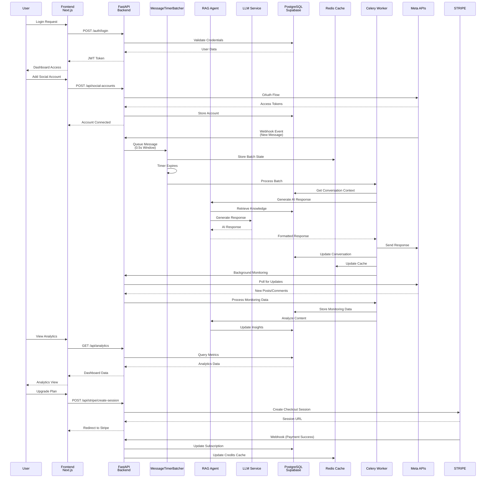

# Diagrammes d'Architecture - SocialSyncAI Enterprise

## 1. Diagramme d'Architecture Générale

```mermaid
graph TB
    subgraph "Frontend Layer"
        FE[Next.js React App<br/>TypeScript + TailwindCSS]
        FE --> API[REST API Gateway<br/>FastAPI]
    end

    subgraph "Backend API Layer"
        API --> AUTH[Authentication<br/>JWT + Supabase Auth]
        API --> ROUTERS[API Routers]
        API --> SCHEDULER[APScheduler<br/>Background Tasks]

        ROUTERS --> SOC[Social Accounts Router]
        ROUTERS --> CONV[Conversations Router]
        ROUTERS --> AUTO[Automation Router]
        ROUTERS --> PROC[Process Router]
        ROUTERS --> FAQ[FAQ/QA Router]
        ROUTERS --> AI[AI Settings Router]
        ROUTERS --> MEDIA[Media Router]
        ROUTERS --> STRIPE[Stripe Router]
        ROUTERS --> MONITOR[Monitoring Router]
        ROUTERS --> ANALYTICS[Analytics Router]
    end

    subgraph "Service Layer"
        ROUTERS --> SERVICES[Business Services]

        SERVICES --> RAG[RAG Agent Service<br/>LangChain + Vector DB]
        SERVICES --> RESP[Response Manager<br/>AI Decision Making]
        SERVICES --> CONV_S[Conversation Service<br/>Message Processing]
        SERVICES --> AUTO_S[Automation Service<br/>Rule-based Actions]
        SERVICES --> MONITOR_S[Monitoring Service<br/>Post Tracking]
        SERVICES --> ANALYTICS_S[Analytics Service<br/>Usage Metrics]
        SERVICES --> CREDITS_S[Credits Service<br/>Usage Tracking]
        SERVICES --> STRIPE_S[Stripe Service<br/>Payments]
        SERVICES --> EMAIL_S[Email Service<br/>Notifications]
        SERVICES --> STORAGE_S[Storage Service<br/>File Management]
        SERVICES --> TOKEN_S[Token Refresh Service<br/>OAuth Management]

        SERVICES --> BATCHER[Message Timer Batcher<br/>In-Memory Batching]
        BATCHER --> REDIS[(Redis Cache<br/>Session Store)]
    end

    subgraph "Data Layer"
        SERVICES --> DB[(PostgreSQL<br/>Supabase)]
        RAG --> VECTOR[(Vector Database<br/>RedisVL)]
        STORAGE_S --> BUCKET[(Cloud Storage<br/>Google Cloud Storage)]
    end

    subgraph "Worker Layer"
        SCHEDULER --> CELERY[Celery Workers]
        CELERY --> REDIS_QUEUE[(Redis Queue<br/>Task Queue)]
        CELERY --> WORKERS[Async Workers]

        WORKERS --> WEBHOOK_WORKER[Webhook Processor<br/>Social Media APIs]
        WORKERS --> AI_WORKER[AI Processing Worker<br/>LLM Inference]
        WORKERS --> MONITOR_WORKER[Monitoring Worker<br/>Content Tracking]
        WORKERS --> CLEANUP_WORKER[Cleanup Worker<br/>Data Maintenance]
    end

    subgraph "External APIs"
        WEBHOOK_WORKER --> META[Meta APIs<br/>WhatsApp, Instagram, Messenger]
        WEBHOOK_WORKER --> WEBHOOKS[Webhook Handlers<br/>Real-time Events]
        AI_WORKER --> LLM[LLM Providers<br/>Anthropic, OpenAI, Google]
    end

    subgraph "Infrastructure"
        subgraph "Google Cloud Platform"
            CLOUD_RUN[Cloud Run<br/>API Deployment]
            COMPUTE_ENGINE[Compute Engine<br/>Worker Deployment]
            GCS[Cloud Storage<br/>File Storage]
            REDIS_CLOUD[Memorystore Redis<br/>Cache & Queue]
            SUPABASE[Supabase<br/>Database & Auth]
        end
    end

    style FE fill:#e1f5fe
    style API fill:#f3e5f5
    style SERVICES fill:#e8f5e8
    style WORKERS fill:#fff3e0
    style DB fill:#fce4ec
    style META fill:#f1f8e9
    style CLOUD_RUN fill:#e3f2fd
```



## 2. Diagramme d'Application - Flux de Données



## 3. Diagramme de la Tech Stack

```mermaid
mindmap
  root((SocialSyncAI<br/>Enterprise))
    Frontend
      Next.js 15.5.7
        React 18.3.1
        TypeScript 5
        TailwindCSS 4.1.9
        UI Components
          Radix UI
            Dialog, Dropdown, Tabs
            Accordion, Avatar, Checkbox
          Shadcn/ui Components
        State Management
          Zustand
          React Query 5.90.5
        Utilities
          Lucide React Icons
          Date-fns
          clsx + tailwind-merge
          React Hook Form + Zod
    Backend
      FastAPI 0.115.6
        Python 3.12
        Uvicorn ASGI Server
        Pydantic Models
        SQLAlchemy ORM
        AsyncPG Driver
      API Structure
        Modular Routers
          Social Accounts, Conversations
          Automation, Process, FAQ/QA
          AI Settings, Media, Stripe
          Monitoring, Analytics
        Middleware
          CORS, Authentication
          Request Validation
      Services Layer
        AI & ML
          LangChain 0.3.27
          LangGraph 0.6.7
          Anthropic Claude
          OpenAI GPT
          Google Gemini
        Social Media
          Meta Graph API v23.0
          WhatsApp Business API
          Instagram Basic Display
          Messenger Platform
        Business Logic
          Response Manager
          RAG Agent (Vector Search)
          Message Batching
          Automation Engine
          Credits System
          Monitoring System
    Database & Storage
      Supabase
        PostgreSQL
        Supabase Auth
        Row Level Security
        Real-time Subscriptions
      Redis Stack
        RedisVL (Vector Search)
        Redis Queue (Celery)
        Session Cache
        Message Batching
      Google Cloud Storage
        Media Files
        User Uploads
        Static Assets
    Infrastructure
      Google Cloud Platform
        Cloud Run (API)
        Compute Engine (Workers)
        Cloud Storage
        Memorystore Redis
        Secret Manager
      Deployment
        Docker Containers
        Docker Compose
        Terraform (IaC)
        CI/CD Pipelines
      Monitoring & Observability
        Google Cloud Logging
        Google Cloud Monitoring
        Sentry Error Tracking
        Prometheus Metrics
    External Services
      Stripe (Payments)
        Subscription Management
        Webhook Handling
        Usage-based Billing
      Email Service
        Resend (Transactional)
        Notification Templates
      AI Providers
        Anthropic Claude API
        OpenAI API
        Google AI API
        Multiple Fallbacks
    Development Tools
      Package Management
        Poetry (Python)
        npm (Node.js)
      Testing
        pytest (Python)
        Playwright (E2E)
      Code Quality
        ESLint, Prettier
        Black, isort, mypy
        Pre-commit Hooks
      Development
        VS Code Extensions
        Hot Reload (Next.js)
        Debug Configurations


