# 🏗️ Architecture Documentation

System design and technical architecture for SocialSync AI

---

## 📋 Table of Contents

1. [System Overview](#system-overview)
2. [High-Level Architecture](#high-level-architecture)
3. [Component Breakdown](#component-breakdown)
4. [Data Flow](#data-flow)
5. [AI/ML Layer](#aiml-layer)
6. [Database Design](#database-design)
7. [API Architecture](#api-architecture)
8. [Worker System](#worker-system)
9. [Security Architecture](#security-architecture)
10. [Scalability & Performance](#scalability--performance)

---

## System Overview

**SocialSync AI** is a **cloud-native, event-driven** social media automation platform built with:
- **Microservices architecture** (FastAPI backend, Next.js frontend, Celery workers)
- **Event-driven design** (webhooks, message queues)
- **AI-first approach** (LLM-powered automation, RAG, vector search)
- **Multi-tenancy** (user isolation, RLS)

### Core Principles

1. **Separation of Concerns** - API, Workers, AI services are isolated
2. **Event-Driven** - Webhooks trigger async processing
3. **Stateless APIs** - All state in PostgreSQL/Redis
4. **Scalable Workers** - Celery for background jobs
5. **AI Modularity** - Swappable LLM providers (OpenRouter, OpenAI)

---

## High-Level Architecture


---

## Component Breakdown

### 1. Frontend (Next.js 14)

**Technology:**
- **Framework:** Next.js 14 (App Router)
- **Language:** TypeScript 5.0+
- **UI:** Tailwind CSS + shadcn/ui
- **State:** Zustand
- **Auth:** Supabase Auth (JWT)

**Key Features:**
- **Server-Side Rendering (SSR)** - SEO-friendly pages
- **API Routes** - Serverless functions for webhooks
- **Real-time Updates** - Supabase Realtime subscriptions
- **Responsive Design** - Mobile-first UI

**Directory Structure:**
```
frontend/
├── app/
│   ├── (auth)/          # Auth pages (login, register)
│   ├── dashboard/       # Protected pages
│   │   ├── inbox/       # DM management
│   │   ├── comments/    # Comment moderation
│   │   ├── calendar/    # Post scheduling
│   │   ├── analytics/   # Performance dashboards
│   │   └── settings/    # Configuration
│   ├── api/             # API routes (webhooks)
│   └── layout.tsx       # Root layout
├── components/          # Reusable components
│   ├── ui/              # shadcn/ui components
│   ├── calendar/        # Calendar components
│   ├── comments/        # Comment components
│   └── inbox/           # Inbox components
└── lib/                 # Utilities
    ├── supabase.ts      # Supabase client
    └── utils.ts         # Helper functions
```

---

### 2. Backend (FastAPI)

**Technology:**
- **Framework:** FastAPI 0.100+
- **Language:** Python 3.10+
- **ORM:** Supabase Client (direct SQL)
- **Validation:** Pydantic v2
- **Auth:** JWT (Supabase)

**Key Features:**
- **Async/Await** - Non-blocking I/O
- **Auto Documentation** - OpenAPI (Swagger)
- **Type Safety** - Pydantic models
- **Dependency Injection** - FastAPI DI system

**Directory Structure:**
```
backend/
├── app/
│   ├── main.py              # FastAPI app entry
│   ├── routers/             # API endpoints
│   │   ├── auth.py          # Authentication
│   │   ├── instagram.py     # Instagram management
│   │   ├── whatsapp.py      # WhatsApp management
│   │   ├── scheduled_posts.py
│   │   ├── ai_settings.py   # AI configuration
│   │   └── analytics.py     # Analytics endpoints
│   ├── services/            # Business logic
│   │   ├── rag_agent.py     # RAG Agent (LangGraph)
│   │   ├── automation_service.py
│   │   ├── comment_triage.py
│   │   ├── escalation.py
│   │   ├── instagram_service.py
│   │   └── email_service.py
│   ├── workers/             # Celery tasks
│   │   ├── celery_app.py    # Celery config
│   │   ├── comments.py      # Comment polling
│   │   ├── messages.py      # DM polling
│   │   └── scheduler.py     # Post scheduling
│   ├── schemas/             # Pydantic models
│   ├── deps/                # Dependencies
│   │   └── system_prompt.py # AI system prompt
│   └── db/                  # Database utilities
│       └── migrate.py       # Migration runner
└── tests/                   # Test suite
```

**API Endpoints:**

| Endpoint | Method | Description |
|----------|--------|-------------|
| `/api/auth/register` | POST | Create new user |
| `/api/auth/login` | POST | Login user |
| `/api/instagram/connect` | POST | OAuth connection |
| `/api/instagram/conversations` | GET | List DM threads |
| `/api/instagram/messages/{id}` | GET | Get conversation |
| `/api/instagram/posts` | GET | List posts |
| `/api/comments/pending` | GET | Pending comments |
| `/api/scheduled-posts` | GET/POST | Manage scheduled posts |
| `/api/analytics/overview` | GET | Dashboard stats |
| `/api/ai-settings` | GET/PUT | AI configuration |
| `/webhooks/instagram` | POST | Instagram events |
| `/webhooks/whatsapp` | POST | WhatsApp events |

---

### 3. Worker System (Celery)

**Technology:**
- **Framework:** Celery 5.3+
- **Broker:** Redis
- **Result Backend:** Redis
- **Scheduler:** Celery Beat

**Workers:**


**Task Types:**

| Task | Frequency | Description |
|------|-----------|-------------|
| `poll_instagram_messages` | 0.5s | Check for new DMs |
| `poll_instagram_comments` | 5-30min (adaptive) | Check new comments |
| `process_message` | On-demand | AI response to DM |
| `process_comment` | On-demand | AI response to comment |
| `publish_scheduled_post` | 1min check | Publish scheduled posts |
| `retry_failed_post` | 5min | Retry failed publishes |
| `generate_analytics` | Daily | Aggregate analytics |
| `cleanup_old_data` | Weekly | Archive old messages |

**Worker Configuration:**
```python
# Celery settings
CELERY_BROKER_URL = "redis://redis:6379/0"
CELERY_RESULT_BACKEND = "redis://redis:6379/0"
CELERY_TASK_SERIALIZER = "json"
CELERY_RESULT_SERIALIZER = "json"
CELERY_ACCEPT_CONTENT = ["json"]
CELERY_TIMEZONE = "UTC"
CELERY_TASK_SOFT_TIME_LIMIT = 300  # 5 minutes
CELERY_TASK_TIME_LIMIT = 600       # 10 minutes
CELERY_WORKER_CONCURRENCY = 4      # 4 concurrent tasks
```

---

### 4. AI/ML Layer

**Components:**


**RAG Agent (LangGraph State Machine):**

```python
# Agent workflow
StateGraph:
  1. __start__ → check_conversation_state
  2. check_conversation_state → retrieve_context
  3. retrieve_context → call_llm
  4. call_llm → tool_execution (if tool_calls)
  5. tool_execution → call_llm (loop)
  6. call_llm → __end__ (no tool_calls)
```

**Tools Available:**

| Tool | Description | Usage |
|------|-------------|-------|
| `search_knowledge` | Vector search in knowledge base | Auto-invoked for questions |
| `find_answers` | Retrieve FAQ answers | Auto-invoked for common questions |
| `escalation` | Escalate to human support | Auto-invoked for keywords: "human", "urgent" |
| `search_files` | Search uploaded documents | On-demand |

**LLM Models Supported:**

| Provider | Models | Cost/1M tokens |
|----------|--------|----------------|
| OpenAI | gpt-4o, gpt-4-turbo, gpt-3.5-turbo | $5-$15 |
| Anthropic | claude-3.5-sonnet, claude-3-opus | $3-$15 |
| Google | gemini-1.5-pro, gemini-1.5-flash | $2-$7 |
| Meta | llama-3.1-405b, llama-3.1-70b | $1-$5 |

**Vector Store (pg_vector):**
- **Embedding Model:** text-embedding-004 (Google Gemini)
- **Dimensions:** 768
- **Distance Metric:** Cosine similarity (inner product <#>)
- **Tables:** `knowledge_chunks`, `faq_qa`
- **Index:** HNSW for fast similarity search

---

## Data Flow

### 1. DM Automation Flow


### 2. Comment Moderation Flow


### 3. Scheduled Post Publishing Flow

```mermaid
sequenceDiagram
    participant USER as User (Frontend)
    participant API as Backend API
    participant DB as Supabase
    participant BEAT as Celery Beat
    participant WORKER as Scheduler Worker
    participant IG as Instagram API

    USER->>API: POST /scheduled-posts
    API->>DB: Insert scheduled_post (status=queued)
    API-->>USER: Post scheduled ✅

    Note over BEAT: Every 1 minute
    BEAT->>WORKER: check_scheduled_posts()
    WORKER->>DB: SELECT posts WHERE publish_at <= NOW()
    DB-->>WORKER: Due posts

    loop For each post
        WORKER->>DB: UPDATE status=publishing
        WORKER->>IG: POST /media (upload image)
        IG-->>WORKER: media_id
        WORKER->>IG: POST /media_publish
        IG-->>WORKER: Success/Failure

        alt Success
            WORKER->>DB: UPDATE status=published
        else Failure
            WORKER->>DB: UPDATE status=failed, retry_count++
            Note over WORKER: Retry in 5min (max 3 attempts)
        end
    end
```



### 4. Knowledge Base RAG Flow


---

## Database Design

See [DATABASE.md](./DATABASE.md) for complete schema reference.

**Key Tables:**


**Core Tables (25 total):**

1. **users** - User accounts
2. **social_accounts** - Instagram/WhatsApp connections
3. **conversations** - DM threads
4. **messages** - Individual messages
5. **comments** - Post comments
6. **posts** - Social media posts
7. **scheduled_posts** - Queued posts
8. **ai_settings** - AI configuration per user
9. **ai_decisions** - AI decision log
10. **support_escalations** - Human escalations
11. **files** - Knowledge base documents
12. **analytics_daily** - Performance metrics
13. ... (12 more tables)

**Row Level Security (RLS):**

All tables have RLS policies:
```sql
-- Example: users can only see their own data
CREATE POLICY "Users can view own data"
ON conversations
FOR SELECT
USING (auth.uid() = user_id);
```

---

## API Architecture

### REST API Design

**Principles:**
- **RESTful** - Resources, HTTP verbs
- **JSON** - All requests/responses
- **JWT** - Bearer token authentication
- **Versioning** - `/api/v1/...` (future)
- **Pagination** - Cursor-based (limit/offset)

**Authentication Flow:**


**Error Handling:**

```json
// Standard error response
{
  "detail": {
    "error_code": "UNAUTHORIZED",
    "message": "Invalid or expired token",
    "timestamp": "2025-10-30T12:00:00Z"
  }
}
```

**HTTP Status Codes:**
- `200 OK` - Success
- `201 Created` - Resource created
- `400 Bad Request` - Validation error
- `401 Unauthorized` - Auth failure
- `403 Forbidden` - Insufficient permissions
- `404 Not Found` - Resource not found
- `429 Too Many Requests` - Rate limit
- `500 Internal Server Error` - Server error

---

## Worker System

### Celery Architecture

**Broker:** Redis (task queue)
**Backend:** Redis (result storage)
**Scheduler:** Celery Beat (cron-like)

**Task Priority:**

| Priority | Queue | Tasks |
|----------|-------|-------|
| High | `high` | Webhooks, real-time DMs |
| Normal | `default` | Comments, analytics |
| Low | `low` | Cleanup, archiving |

**Retry Logic:**

```python
@celery_app.task(
    bind=True,
    max_retries=3,
    default_retry_delay=60,  # 1 minute
    autoretry_for=(Exception,),
    retry_backoff=True,      # Exponential backoff
    retry_backoff_max=600,   # Max 10 minutes
    retry_jitter=True        # Random jitter
)
def publish_scheduled_post(self, post_id: str):
    # Task logic
    pass
```

**Monitoring:**

```bash
# View active tasks
celery -A app.workers.celery_app inspect active

# View scheduled tasks
celery -A app.workers.celery_app inspect scheduled

# View worker stats
celery -A app.workers.celery_app inspect stats
```

---

## Security Architecture

### 1. Authentication & Authorization

**JWT Tokens:**
- **Access Token:** 30 minutes lifetime
- **Refresh Token:** 7 days lifetime
- **Algorithm:** HS256
- **Secret:** 256-bit random key

**Row Level Security (RLS):**
```sql
-- Every table has RLS enabled
ALTER TABLE conversations ENABLE ROW LEVEL SECURITY;

-- Users only access their own data
CREATE POLICY "user_isolation"
ON conversations
USING (user_id = auth.uid());
```

### 2. API Security

**Rate Limiting:**
```python
# FastAPI middleware
from slowapi import Limiter

limiter = Limiter(key_func=get_remote_address)

@app.get("/api/conversations")
@limiter.limit("60/minute")  # 60 requests per minute
async def get_conversations():
    pass
```

**CORS:**
```python
# Allow only specific origins
app.add_middleware(
    CORSMiddleware,
    allow_origins=["http://localhost:3000", "https://yourdomain.com"],
    allow_credentials=True,
    allow_methods=["*"],
    allow_headers=["*"],
)
```

### 3. Data Security

**Encryption:**
- **At Rest:** Supabase encryption (AES-256)
- **In Transit:** TLS 1.3 (HTTPS)
- **Secrets:** Environment variables (never committed)

**Webhook Verification:**
```python
# Instagram webhook signature verification
def verify_instagram_signature(payload: bytes, signature: str) -> bool:
    expected_signature = hmac.new(
        INSTAGRAM_APP_SECRET.encode(),
        payload,
        hashlib.sha256
    ).hexdigest()
    return hmac.compare_digest(signature, f"sha256={expected_signature}")
```

### 4. Content Moderation

**OpenAI Moderation API:**
```python
# Check content before posting
moderation_result = openai.Moderation.create(input=comment_text)

if moderation_result.results[0].flagged:
    # Block: hate, harassment, violence, sexual, self-harm
    categories = moderation_result.results[0].categories
    # Log and don't post
```

**Custom Guardrails:**
- **Keyword Blocking:** User-defined blocked words
- **Phrase Blocking:** Multi-word phrase detection
- **Confidence Threshold:** Only post if confidence > 0.7

---

## Scalability & Performance

### Horizontal Scaling

**Components that scale:**

| Component | Scaling Strategy | Tool |
|-----------|------------------|------|
| Backend API | Horizontal (N instances) | Kubernetes, Docker Swarm |
| Celery Workers | Horizontal (N workers) | Docker Compose scale |
| Redis | Vertical + Cluster | Redis Cluster, AWS ElastiCache |
| PostgreSQL + pg_vector | Vertical + Read Replicas | Supabase Pro, AWS RDS |

**Example Docker Compose Scaling:**
```bash
# Scale workers to 5 instances
docker-compose up -d --scale celery=5
```

### Caching Strategy

**Redis Cache Layers:**


**Cache Keys:**
- `user:{user_id}:settings` - AI settings (TTL: 5min)
- `user:{user_id}:social_accounts` - Social accounts (TTL: 10min)
- `conversation:{conv_id}:messages` - Message history (TTL: 1min)
- `post:{post_id}:comments` - Comments (TTL: 5min)

**Cache Invalidation:**
```python
# Invalidate on update
await redis.delete(f"user:{user_id}:settings")
```

### Database Optimization

**Indexes:**
```sql
-- Performance-critical indexes
CREATE INDEX idx_conversations_user_id ON conversations(user_id);
CREATE INDEX idx_messages_conversation_id ON messages(conversation_id);
CREATE INDEX idx_comments_post_id ON comments(post_id);
CREATE INDEX idx_scheduled_posts_publish_at ON scheduled_posts(publish_at);
CREATE INDEX idx_ai_decisions_user_id ON ai_decisions(user_id);
```

**Query Optimization:**
```sql
-- Use EXPLAIN ANALYZE to optimize slow queries
EXPLAIN ANALYZE
SELECT * FROM messages
WHERE conversation_id = 'xxx'
ORDER BY created_at DESC
LIMIT 50;
```

### Performance Metrics

**Target SLAs:**

| Metric | Target | Measurement |
|--------|--------|-------------|
| API Response Time (p95) | < 200ms | FastAPI middleware |
| DM Response Time | < 2s | Celery task duration |
| Comment Response Time | < 5s | Celery task duration |
| Post Publish Accuracy | > 99.5% | Scheduled posts delivered |
| AI Response Quality | > 90% satisfaction | User feedback |
| Uptime | 99.9% | Status page |

**Monitoring:**
- **Application:** Sentry (errors), LogRocket (sessions)
- **Infrastructure:** Prometheus + Grafana
- **Logs:** ELK Stack (Elasticsearch, Logstash, Kibana)

---

## Technology Stack Summary

### Backend
- **Python 3.10+** - Core language
- **FastAPI 0.100+** - Web framework
- **Celery 5.3+** - Task queue
- **Redis 7.0+** - Cache + broker
- **Pydantic v2** - Data validation

### Frontend
- **Next.js 14** - React framework
- **TypeScript 5.0+** - Type safety
- **Tailwind CSS** - Styling
- **shadcn/ui** - Component library
- **Zustand** - State management

### AI/ML
- **LangChain** - LLM framework
- **LangGraph** - Agent orchestration
- **pg_vector** - Vector extension for PostgreSQL
- **OpenRouter** - LLM gateway (100+ models)
- **OpenAI Moderation** - Content safety

### Database & Storage
- **Supabase** - PostgreSQL + Auth + Storage
- **PostgreSQL 15+** - Relational database
- **S3-compatible** - Media storage

### DevOps
- **Docker** - Containerization
- **Docker Compose** - Local orchestration
- **GitHub Actions** - CI/CD (future)
- **Kubernetes** - Production orchestration (future)

---

## Deployment Architecture (Production)


**Infrastructure Recommendations:**

| Component | Development | Production |
|-----------|-------------|------------|
| **API Servers** | 1 container | 3+ instances (auto-scaling) |
| **Workers** | 1 container | 5+ workers (auto-scaling) |
| **Redis** | 1 instance | Redis Cluster (3+ nodes) |
| **PostgreSQL** | Supabase Free | Supabase Pro + Replicas |
| **Hosting** | Docker Compose | AWS ECS, GCP Cloud Run, K8s |

---

## Next Steps

- **Read Feature Docs:** [features/](./features/)
- **Read Technical Docs:** [technical/](./technical/)
- **Database Schema:** [DATABASE.md](./DATABASE.md)

---

**Last Updated:** 2025-10-30
