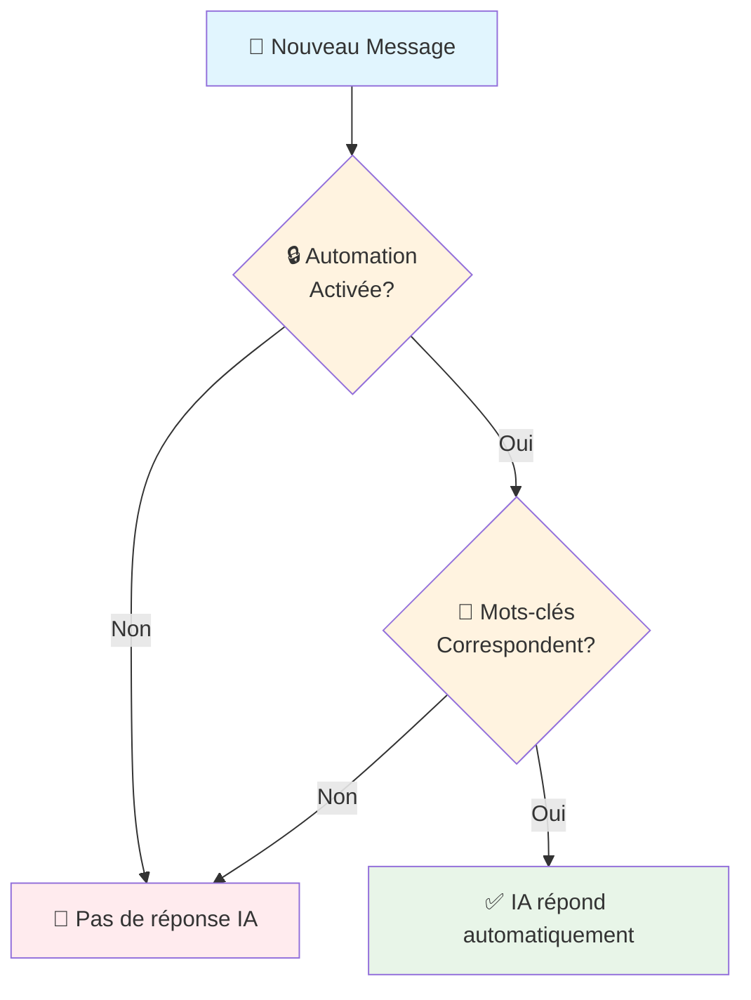

# 🚀 Guide Rapide - Système d'Automation

## ⚡ Démarrage en 5 minutes

### Vue d'ensemble du système


### 1. 📋 Appliquer la Migration
```bash
cd /workspace/backend
psql -d socialsync -f migrations/add_automation_controls.sql
```

### 2. 🔄 Redémarrer le Backend
```bash
# Si tu utilises uvicorn directement
uvicorn app.main:app --reload --host 0.0.0.0 --port 8000

# Ou si tu as PM2/Docker
pm2 restart socialsync-api
```

### 3. ✅ Tester les Endpoints
Ouvre http://localhost:8000/docs et cherche la section **"Automation"**

## 🎯 Cas d'Usage Rapides

### Cas 1: Désactiver IA pour une conversation
```bash
curl -X PATCH "http://localhost:8000/api/automation/conversations/YOUR_CONV_ID/toggle" \
  -H "Authorization: Bearer YOUR_TOKEN" \
  -H "Content-Type: application/json" \
  -d '{"enabled": false}'
```

### Cas 2: Répondre seulement aux urgences
```bash
curl -X POST "http://localhost:8000/api/automation/keyword-rules" \
  -H "Authorization: Bearer YOUR_TOKEN" \
  -H "Content-Type: application/json" \
  -d '{
    "scope_type": "user",
    "keywords": ["urgent", "help", "aide", "emergency"],
    "description": "Réponses urgences uniquement"
  }'
```

### Cas 3: Vérifier si l'IA répondrait
```bash
curl -X POST "http://localhost:8000/api/automation/conversations/YOUR_CONV_ID/check?message_content=Bonjour" \
  -H "Authorization: Bearer YOUR_TOKEN"
```

## 📊 Monitoring Rapide

### Logs à Surveiller
```bash
# Voir les décisions d'automation en temps réel
tail -f /var/log/socialsync/app.log | grep "Auto-réponse"
```

### Exemples de Logs
```
✅ Auto-réponse autorisée pour whatsapp:123:+33612345678 - Règles matchées: ["Urgences (ID: abc-123)"]
🚫 Auto-réponse bloquée pour instagram:456:user789 - Raison: Automation désactivée pour cette conversation
🚫 Auto-réponse bloquée pour whatsapp:789:+33698765432 - Raison: Aucune règle de mots-clés ne correspond
```

## 🔧 Commandes Utiles

### Lister toutes les règles d'un utilisateur
```bash
curl "http://localhost:8000/api/automation/keyword-rules" \
  -H "Authorization: Bearer YOUR_TOKEN"
```

### Désactiver temporairement une règle
```bash
curl -X PATCH "http://localhost:8000/api/automation/keyword-rules/RULE_ID" \
  -H "Authorization: Bearer YOUR_TOKEN" \
  -H "Content-Type: application/json" \
  -d '{"is_enabled": false}'
```

### Supprimer une règle
```bash
curl -X DELETE "http://localhost:8000/api/automation/keyword-rules/RULE_ID" \
  -H "Authorization: Bearer YOUR_TOKEN"
```

## 🚨 Troubleshooting

### Problème: IA répond encore alors que c'est désactivé
1. Vérifiez les logs: `grep "Auto-réponse" /var/log/socialsync/app.log`
2. Vérifiez la BDD: `SELECT automation_disabled FROM conversations WHERE id = 'YOUR_ID';`
3. Redémarrez le BatchScanner

### Problème: Règles de mots-clés ne fonctionnent pas
1. Testez avec l'endpoint `/check`: `curl ...conversations/ID/check?message_content=test`
2. Vérifiez que `is_enabled = true` dans la règle
3. Vérifiez le `scope_type` et `scope_id`

### Problème: Pas de logs d'automation
1. Vérifiez que le niveau de log est INFO: `logging.basicConfig(level=logging.INFO)`
2. Vérifiez que le BatchScanner utilise la nouvelle version avec AutomationService

---

## 📖 Ressources

- **Documentation complète**: [AUTOMATION_SYSTEM.md](./AUTOMATION_SYSTEM.md)
- **API Swagger**: http://localhost:8000/docs#/Automation
- **Schémas de BDD**: [migrations/add_automation_controls.sql](../backend/migrations/add_automation_controls.sql)
