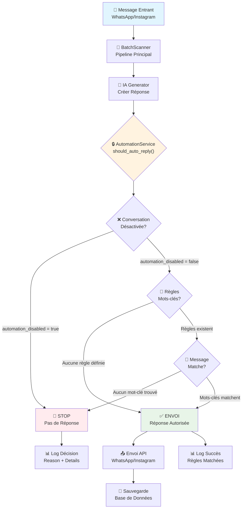
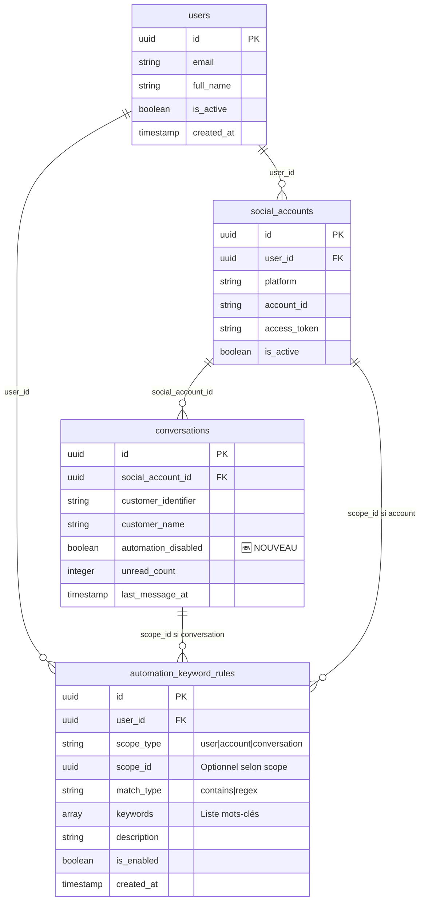
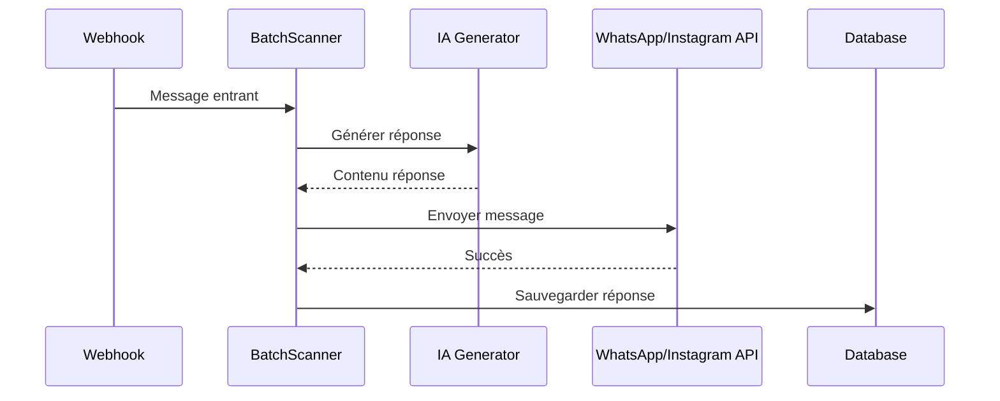
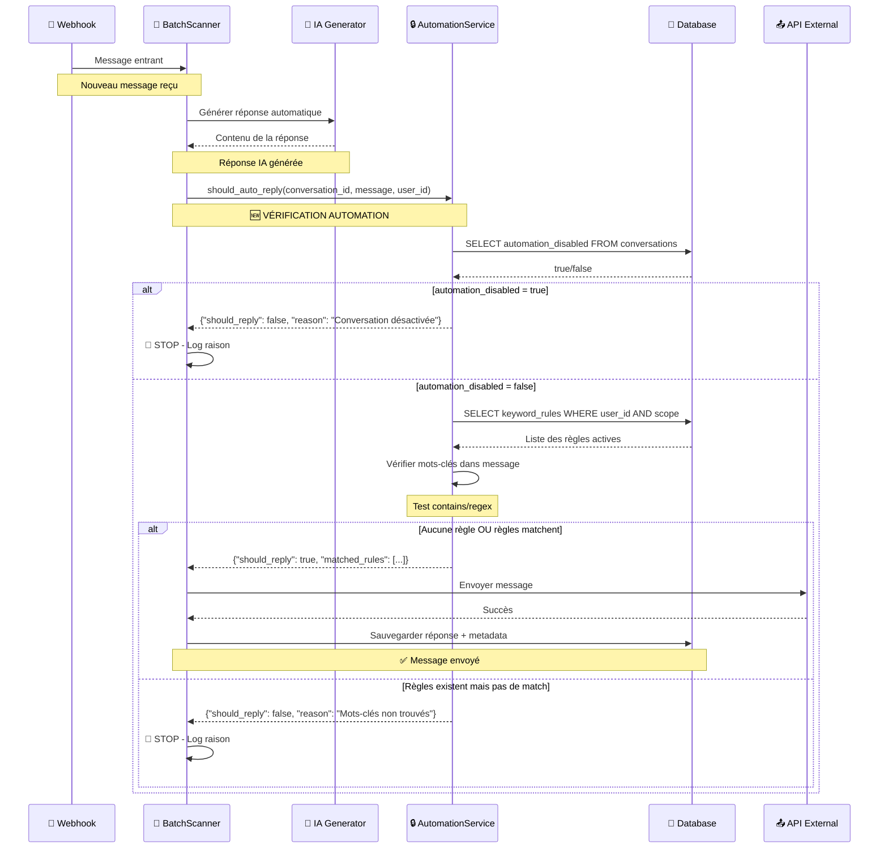
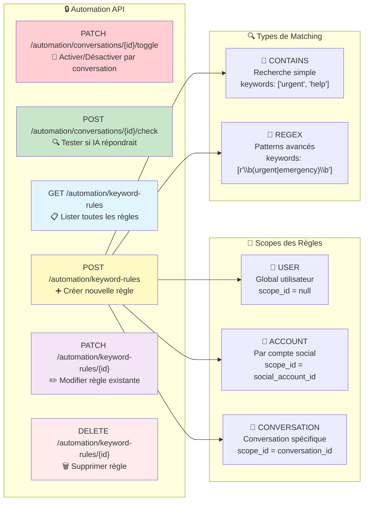
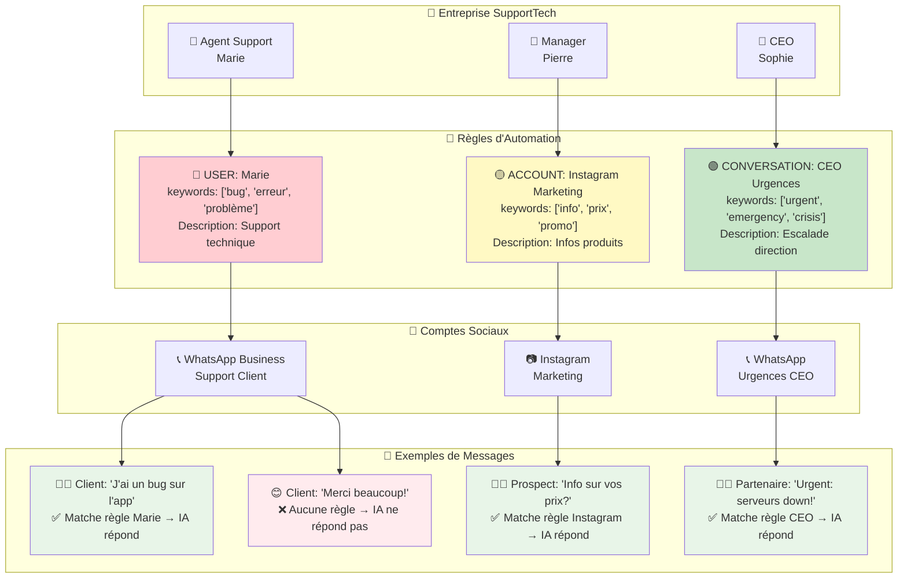

# 🤖 Système d'Automation Intelligent - Documentation Technique

## 📋 Vue d'ensemble

Le système d'automation permet de contrôler finement quand et comment l'IA répond automatiquement aux messages entrants. Il offre trois niveaux de contrôle :

1. **Désactivation par conversation** - Toggle ON/OFF par conversation
2. **Filtrage par mots-clés** - L'IA ne répond que si certains mots sont présents
3. **Contrôle instantané** - Vérification en temps réel (pas de file d'attente)

## 🏗️ Architecture du Système



## 🗄️ Schéma de Base de Données

### Table `conversations` (modifiée)
```sql
CREATE TABLE conversations (
    id UUID PRIMARY KEY,
    social_account_id UUID NOT NULL,
    customer_identifier VARCHAR(255) NOT NULL,
    customer_name VARCHAR(255),
    -- ... autres colonnes existantes ...
    automation_disabled BOOLEAN DEFAULT false, -- ✨ NOUVEAU
    created_at TIMESTAMP WITH TIME ZONE DEFAULT NOW(),
    updated_at TIMESTAMP WITH TIME ZONE DEFAULT NOW()
);
```

### Table `automation_keyword_rules` (nouvelle)
```sql
CREATE TABLE automation_keyword_rules (
    id UUID PRIMARY KEY DEFAULT uuid_generate_v4(),
    user_id UUID NOT NULL REFERENCES users(id),
    scope_type VARCHAR(20) CHECK (scope_type IN ('user', 'account', 'conversation')),
    scope_id UUID, -- social_account_id ou conversation_id selon scope_type
    match_type VARCHAR(20) DEFAULT 'contains' CHECK (match_type IN ('contains', 'regex')),
    keywords TEXT[] NOT NULL,
    description TEXT,
    is_enabled BOOLEAN DEFAULT true,
    created_at TIMESTAMP WITH TIME ZONE DEFAULT NOW(),
    updated_at TIMESTAMP WITH TIME ZONE DEFAULT NOW()
);
```

### Relations et Contraintes


## 🔄 Flux de Traitement des Messages

### 1. Pipeline Normal (Sans Automation)


### 2. Pipeline Avec Automation (Nouveau)


## 🛠️ API Endpoints

### Vue d'ensemble des APIs


### Gestion des Conversations
```http
# Toggle automation pour une conversation
PATCH /api/automation/conversations/{conversation_id}/toggle
Content-Type: application/json
{
  "enabled": true|false
}

# Vérifier si l'IA répondrait à un message
POST /api/automation/conversations/{conversation_id}/check?message_content="Bonjour"
Response: {
  "should_reply": true,
  "reason": "Toutes les conditions sont remplies",
  "matched_rules": ["Règle urgences (ID: abc-123)"]
}
```

### Gestion des Règles de Mots-clés
```http
# Lister toutes les règles
GET /api/automation/keyword-rules
Response: {
  "rules": [...],
  "total": 5
}

# Créer une règle
POST /api/automation/keyword-rules
Content-Type: application/json
{
  "scope_type": "user", // ou "account" ou "conversation"
  "scope_id": null, // UUID si scope != "user"
  "keywords": ["urgent", "help", "problème"],
  "description": "Répondre aux urgences uniquement",
  "match_type": "contains" // ou "regex"
}

# Modifier une règle
PATCH /api/automation/keyword-rules/{rule_id}
Content-Type: application/json
{
  "is_enabled": false,
  "keywords": ["urgent", "help", "aide", "problème"]
}

# Supprimer une règle
DELETE /api/automation/keyword-rules/{rule_id}
```

## 🧩 Services et Classes

### AutomationService
```python
class AutomationService:
    async def should_auto_reply(
        self, 
        conversation_id: str, 
        message_content: str,
        user_id: str
    ) -> Dict[str, Any]:
        """
        Détermine si l'IA doit répondre à ce message
        
        Returns:
        {
            "should_reply": bool,
            "reason": str,
            "matched_rules": List[str]
        }
        """
    
    async def toggle_conversation_automation(
        self, 
        conversation_id: str, 
        user_id: str, 
        enabled: bool
    ) -> bool:
        """Active/désactive l'automation pour une conversation"""
    
    async def create_keyword_rule(...) -> Optional[str]:
        """Crée une nouvelle règle de mots-clés"""
    
    async def _check_conversation_automation(...) -> Dict[str, Any]:
        """Vérifie le flag automation_disabled"""
    
    async def _check_keyword_rules(...) -> Dict[str, Any]:
        """Vérifie les règles de mots-clés"""
    
    def _message_matches_keywords(...) -> bool:
        """Test de correspondance contains/regex"""
```

### Intégration dans BatchScanner
```python
# Dans app/services/batch_scanner.py
async def _process_single_conversation(self, conv_info: Dict[str, Any]):
    # ... génération de réponse ...
    
    # ✨ NOUVEAU : Vérification automation
    if conversation_id and user_id:
        automation_service = AutomationService(get_db())
        automation_check = await automation_service.should_auto_reply(
            conversation_id=conversation_id,
            message_content=last_message_content,
            user_id=user_id
        )
        
        if not automation_check["should_reply"]:
            logger.info(f"Auto-réponse bloquée - {automation_check['reason']}")
            return
    
    # ... envoi de la réponse ...
```

## 📊 Types de Règles et Exemples

### 1. Règles par Scope

#### Scope "user" - Global utilisateur
```json
{
  "scope_type": "user",
  "scope_id": null,
  "keywords": ["urgent", "help"],
  "description": "Répondre aux urgences partout"
}
```
**Effet** : S'applique à TOUTES les conversations de l'utilisateur

#### Scope "account" - Par compte social
```json
{
  "scope_type": "account", 
  "scope_id": "social-account-uuid",
  "keywords": ["info", "renseignement"],
  "description": "Support info sur compte WhatsApp business"
}
```
**Effet** : S'applique uniquement aux conversations de ce compte social

#### Scope "conversation" - Conversation spécifique
```json
{
  "scope_type": "conversation",
  "scope_id": "conversation-uuid", 
  "keywords": ["commande", "status"],
  "description": "Suivi commande client VIP"
}
```
**Effet** : S'applique uniquement à cette conversation

### 2. Types de Matching

#### Contains (Simple)
```python
keywords = ["urgent", "help", "aide"]
message = "J'ai besoin d'aide urgente"
# ✅ Match car contient "aide" et "urgent"
```

#### Regex (Avancé)
```python
keywords = [r"\b(urgent|emergency)\b", r"\d{4}-\d{4}-\d{4}"]
message = "Urgent: problème avec carte 1234-5678-9012"
# ✅ Match sur les deux patterns
```

## 🔄 Cas d'Usage Pratiques

### Exemple d'Entreprise - SupportTech


### Cas 1 : Désactiver IA pendant les heures de travail
```bash
# Désactiver toutes les conversations d'un utilisateur
curl -X POST /api/automation/keyword-rules \
  -d '{
    "scope_type": "user",
    "keywords": ["__NEVER_MATCH__"],
    "description": "Bloquer IA pendant heures bureau"
  }'
```

### Cas 2 : Support technique uniquement
```bash
# Répondre seulement aux mots techniques
curl -X POST /api/automation/keyword-rules \
  -d '{
    "scope_type": "account", 
    "scope_id": "compte-support-uuid",
    "keywords": ["bug", "erreur", "problème", "panne", "help"],
    "description": "Support technique"
  }'
```

### Cas 3 : Client VIP - réponse personnalisée
```bash
# Conversation spécifique avec mots-clés larges
curl -X POST /api/automation/keyword-rules \
  -d '{
    "scope_type": "conversation",
    "scope_id": "conversation-vip-uuid",
    "keywords": ["bonjour", "commande", "info", "merci"],
    "description": "Client VIP - réponse élargie"
  }'
```

## 🚨 Points d'Attention

### Sécurité
- ✅ RLS activé sur `automation_keyword_rules`
- ✅ Vérification des permissions utilisateur dans tous les endpoints
- ✅ Validation des UUID et des types d'entrée

### Performance
- ✅ Index sur `automation_disabled` (WHERE automation_disabled = true)
- ✅ Index sur `(user_id, scope_type, scope_id)` pour les règles
- ✅ Vérification automation en O(1) par conversation

### Monitoring
- ✅ Logs détaillés des décisions d'automation
- ✅ Raisons explicites pour chaque blocage
- ✅ Comptage des règles matchées

## 🔧 Migration et Déploiement

### Script de Migration
```sql
-- Fichier: backend/migrations/add_automation_controls.sql

-- 1. Ajouter automation_disabled à conversations
ALTER TABLE conversations 
ADD COLUMN automation_disabled BOOLEAN DEFAULT false;

-- 2. Créer table automation_keyword_rules
CREATE TABLE automation_keyword_rules (
    -- ... (voir schéma complet dans le fichier)
);

-- 3. Index et contraintes
CREATE INDEX idx_conversations_automation_disabled 
ON conversations(automation_disabled) 
WHERE automation_disabled = true;

-- 4. RLS et triggers
ALTER TABLE automation_keyword_rules ENABLE ROW LEVEL SECURITY;
-- ... (voir fichier complet)
```

### Commandes de Déploiement
```bash
# 1. Appliquer la migration
psql -d socialsync -f backend/migrations/add_automation_controls.sql

# 2. Redémarrer le backend
pm2 restart socialsync-api

# 3. Vérifier les endpoints
curl http://localhost:8000/docs#/Automation
```

## 📈 Métriques et Monitoring

### Logs Générés
```
2025-01-20 15:30:45 - Auto-réponse bloquée pour whatsapp:123:+33612345678 - Raison: Automation désactivée pour cette conversation
2025-01-20 15:31:12 - Auto-réponse autorisée pour instagram:456:user789 - Règles matchées: ["Support technique (ID: abc-123)"]
2025-01-20 15:31:45 - Auto-réponse bloquée pour whatsapp:123:+33698765432 - Raison: Aucune règle de mots-clés ne correspond
```

### Dashboards Suggérés
- Taux de blocage par automation (%)
- Messages bloqués vs envoyés (par heure)
- Règles les plus utilisées
- Conversations avec automation désactivée

---

## 🚀 Prochaines Étapes

1. **Interface Frontend** - UI pour gérer les règles facilement
2. **Webhooks Étendus** - Support commentaires/mentions avec même système  
3. **Règles Avancées** - Horaires, quotas, conditions complexes
4. **Analytics** - Métriques détaillées sur l'automation

---

*Documentation générée le 2025-01-20 - Version 1.0*
