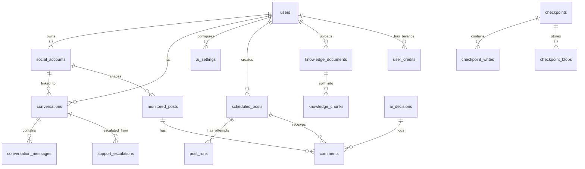

# 🗄️ Database Schema Reference

Complete database schema documentation for SocialSync AI (33 tables)

---

## 📋 Table of Contents

1. [Overview](#overview)
2. [Schema Diagram](#schema-diagram)
3. [Core Tables](#core-tables)
4. [Authentication & Users](#authentication--users)
5. [Social Media Integration](#social-media-integration)
6. [Messaging & Conversations](#messaging--conversations)
7. [AI & Automation](#ai--automation)
8. [Content Management](#content-management)
9. [Analytics & Monitoring](#analytics--monitoring)
10. [Billing & Credits](#billing--credits)
11. [LangGraph Checkpoints](#langgraph-checkpoints)
12. [Indexes & Performance](#indexes--performance)
13. [Row Level Security](#row-level-security)

---

## Overview

**Database:** PostgreSQL 15+ (Supabase)
**Total Tables:** 33
**Extensions:**
- `uuid-ossp` - UUID generation
- `vector` - pg_vector extension for vector embeddings
- `pg_cron` - Scheduled tasks

**Design Principles:**
- ✅ **Multi-tenancy** - User isolation via RLS
- ✅ **JSONB** - Flexible metadata storage
- ✅ **Timestamps** - `created_at`, `updated_at` on all tables
- ✅ **UUIDs** - Primary keys for scalability
- ✅ **Foreign Keys** - Referential integrity

---

## Schema Diagram



---

## Core Tables

### 1. `users`

**Purpose:** User accounts (synced from Supabase Auth)

| Column | Type | Constraints | Description |
|--------|------|-------------|-------------|
| `id` | uuid | PK, FK → auth.users | User UUID |
| `email` | varchar | UNIQUE | User email |
| `full_name` | varchar | nullable | Display name |
| `is_active` | boolean | default: true | Account status |
| `created_at` | timestamptz | default: now() | Registration date |
| `updated_at` | timestamptz | default: now() | Last update |

**Relationships:**
- → `social_accounts.user_id`
- → `conversations.assigned_to`
- → `ai_settings.user_id`
- → `scheduled_posts.user_id`
- → `support_escalations.user_id`
- → `user_credits.user_id`

**RLS:** ✅ Enabled (users see only their own data)

**Example Query:**
```sql
-- Get user with social accounts
SELECT u.*,
       json_agg(sa.*) as social_accounts
FROM users u
LEFT JOIN social_accounts sa ON sa.user_id = u.id
WHERE u.id = auth.uid()
GROUP BY u.id;
```

---

## Authentication & Users

### 2. `ai_settings`

**Purpose:** AI configuration per user

| Column | Type | Default | Description |
|--------|------|---------|-------------|
| `id` | uuid | uuid_generate_v4() | Primary key |
| `user_id` | uuid | - | FK → users (UNIQUE) |
| `ai_model` | text | 'anthropic/claude-3.5-haiku' | OpenRouter model ID |
| `temperature` | numeric | 0.20 | Creativity (0.0-2.0) |
| `top_p` | numeric | 1.00 | Nucleus sampling |
| `lang` | text | 'en' | Response language |
| `tone` | text | 'friendly' | Response tone |
| `system_prompt` | text | - | Custom instructions |
| `ai_control_enabled` | boolean | true | Master AI toggle |
| `ai_enabled_for_chats` | boolean | true | Enable for DMs |
| `ai_enabled_for_comments` | boolean | true | Enable for comments |
| `flagged_keywords` | text[] | {} | Blocked keywords |
| `flagged_phrases` | text[] | {} | Blocked phrases |
| `instructions` | text | nullable | Free-text AI instructions |
| `ignore_examples` | text[] | {} | Messages to ignore |
| `doc_lang` | text[] | {} | Document languages |

**Example:**
```sql
-- Update AI settings
UPDATE ai_settings
SET ai_model = 'openai/gpt-4o',
    temperature = 0.7,
    flagged_keywords = ARRAY['spam', 'viagra', 'casino']
WHERE user_id = auth.uid();
```

---

## Social Media Integration

### 3. `social_accounts`

**Purpose:** Connected Instagram/WhatsApp accounts

| Column | Type | Description |
|--------|------|-------------|
| `id` | uuid | Primary key |
| `user_id` | uuid | FK → users |
| `platform` | social_platform | Enum: instagram, whatsapp, facebook, twitter, etc. |
| `account_id` | varchar | Platform account ID |
| `username` | varchar | @username |
| `display_name` | varchar | Display name |
| `profile_url` | varchar | Profile URL |
| `access_token` | text | OAuth access token (encrypted) |
| `refresh_token` | text | OAuth refresh token |
| `token_expires_at` | timestamptz | Token expiration |
| `is_active` | boolean | default: true |

**Example:**
```sql
-- Get active Instagram accounts
SELECT * FROM social_accounts
WHERE user_id = auth.uid()
  AND platform = 'instagram'
  AND is_active = true;
```

---

## Messaging & Conversations

### 4. `conversations`

**Purpose:** DM threads (Instagram DMs, WhatsApp chats)

| Column | Type | Default | Description |
|--------|------|---------|-------------|
| `id` | uuid | uuid_generate_v4() | Primary key |
| `social_account_id` | uuid | - | FK → social_accounts |
| `external_conversation_id` | varchar | nullable | Platform conversation ID |
| `customer_identifier` | varchar | - | Customer ID |
| `customer_name` | varchar | nullable | Customer name |
| `customer_avatar_url` | varchar | nullable | Avatar URL |
| `status` | varchar | 'open' | open, closed, pending |
| `priority` | varchar | 'normal' | normal, high, urgent |
| `assigned_to` | uuid | nullable | FK → users |
| `tags` | text[] | nullable | Custom tags |
| `ai_mode` | text | 'ON' | 'ON' or 'OFF' |
| `automation_disabled` | boolean | false | Disable AI for this chat |
| `unread_count` | integer | 0 | Unread messages |
| `last_message_at` | timestamptz | nullable | Last message timestamp |
| `metadata` | jsonb | {} | Additional data |

**Important:** `ai_mode` controls per-conversation AI automation. Set to 'OFF' when escalating.

**Example:**
```sql
-- Get active conversations with unread messages
SELECT c.*, sa.username as account_username
FROM conversations c
JOIN social_accounts sa ON sa.id = c.social_account_id
WHERE sa.user_id = auth.uid()
  AND c.status = 'open'
  AND c.unread_count > 0
ORDER BY c.last_message_at DESC;
```

### 5. `conversation_messages`

**Purpose:** Individual messages in conversations

| Column | Type | Description |
|--------|------|-------------|
| `id` | uuid | Primary key |
| `conversation_id` | uuid | FK → conversations |
| `external_message_id` | varchar | Platform message ID (UNIQUE) |
| `direction` | varchar | inbound, outbound |
| `content` | text | Message text |
| `message_type` | varchar | text, image, video, audio |
| `media_type` | varchar | nullable |
| `sender_id` | varchar | Platform sender ID |
| `sender_name` | varchar | Sender display name |
| `sender_avatar_url` | varchar | Avatar URL |
| `is_from_agent` | boolean | false (true if AI/human agent) |
| `agent_id` | uuid | nullable FK → users |
| `reply_to_message_id` | uuid | nullable FK → conversation_messages |
| `status` | varchar | sent, delivered, read, failed |
| `storage_object_name` | varchar | nullable (media files) |
| `metadata` | jsonb | {} |

**Example:**
```sql
-- Get conversation history (last 50 messages)
SELECT *
FROM conversation_messages
WHERE conversation_id = 'conv-uuid-here'
ORDER BY created_at DESC
LIMIT 50;
```

---

## AI & Automation

### 6. `ai_decisions`

**Purpose:** Log of AI decisions for traceability

| Column | Type | Description |
|--------|------|-------------|
| `id` | uuid | Primary key |
| `user_id` | uuid | FK → users |
| `message_id` | uuid | nullable (comment or message) |
| `decision` | text | 'respond', 'ignore', 'escalate' |
| `confidence` | numeric | 0.000 to 1.000 |
| `reason` | text | Human-readable explanation |
| `matched_rule` | text | Which rule triggered decision |
| `message_text` | text | Original message (truncated to 500 chars) |
| `snapshot_json` | jsonb | nullable (full context) |
| `created_at` | timestamptz | Decision timestamp |

**Example:**
```sql
-- Get AI decision stats for last 7 days
SELECT
  decision,
  COUNT(*) as count,
  AVG(confidence) as avg_confidence
FROM ai_decisions
WHERE user_id = auth.uid()
  AND created_at >= NOW() - INTERVAL '7 days'
GROUP BY decision;
```

### 7. `support_escalations`

**Purpose:** Human escalations (when AI can't handle request)

| Column | Type | Description |
|--------|------|-------------|
| `id` | uuid | Primary key |
| `user_id` | uuid | FK → users |
| `conversation_id` | uuid | FK → conversations |
| `message` | text | Customer message requiring human |
| `confidence` | float8 | AI confidence (0.0-1.0) |
| `reason` | text | Why escalated (urgent_request, legal_matter, etc.) |
| `notified` | boolean | false (true if email sent) |
| `created_at` | timestamptz | Escalation time |

**Escalation Reasons:**
- `urgent_request` - Customer needs immediate help
- `human_requested` - Explicitly asked for human agent
- `legal_matter` - Legal/compliance issue
- `ai_limitation` - AI can't answer confidently
- `complex_issue` - Requires human judgment

**Example:**
```sql
-- Get unnotified escalations
SELECT e.*, c.customer_name
FROM support_escalations e
JOIN conversations c ON c.id = e.conversation_id
WHERE e.user_id = auth.uid()
  AND e.notified = false
ORDER BY e.created_at DESC;
```

---

## Content Management

### 8. `scheduled_posts`

**Purpose:** Scheduled social media posts

| Column | Type | Description |
|--------|------|-------------|
| `id` | uuid | Primary key |
| `user_id` | uuid | FK → users |
| `channel_id` | uuid | FK → social_accounts |
| `platform` | text | 'instagram', 'whatsapp' |
| `content_json` | jsonb | {text: string, media: [{type, url}]} |
| `publish_at` | timestamptz | When to publish |
| `rrule` | text | nullable (RFC 5545 recurrence rule) |
| `status` | text | 'queued', 'publishing', 'published', 'failed', 'cancelled' |
| `retry_count` | integer | 0 (max 3 retries) |
| `platform_post_id` | text | nullable (ID from Instagram API) |
| `error_message` | text | nullable (if failed) |
| `last_check_at` | timestamptz | nullable (comment polling) |
| `next_check_at` | timestamptz | nullable (adaptive polling) |
| `stop_at` | timestamptz | nullable (stop polling after 7 days) |

**Status Flow:**
```
queued → publishing → published
              ↓
           failed (retry up to 3x)
```

**Example:**
```sql
-- Get posts due for publishing
SELECT *
FROM scheduled_posts
WHERE user_id = auth.uid()
  AND status = 'queued'
  AND publish_at <= NOW()
ORDER BY publish_at ASC;
```

### 9. `post_runs`

**Purpose:** Execution history for scheduled posts

| Column | Type | Description |
|--------|------|-------------|
| `id` | uuid | Primary key |
| `scheduled_post_id` | uuid | FK → scheduled_posts |
| `started_at` | timestamptz | nullable |
| `finished_at` | timestamptz | nullable |
| `status` | text | 'success', 'failed' |
| `error` | text | nullable (error message) |
| `created_at` | timestamptz | Attempt timestamp |

**Example:**
```sql
-- Get failed post attempts
SELECT pr.*, sp.content_json->>'text' as caption
FROM post_runs pr
JOIN scheduled_posts sp ON sp.id = pr.scheduled_post_id
WHERE sp.user_id = auth.uid()
  AND pr.status = 'failed'
ORDER BY pr.created_at DESC;
```

### 10. `comments`

**Purpose:** Comments on Instagram posts (with AI moderation)

| Column | Type | Description |
|--------|------|-------------|
| `id` | uuid | Primary key |
| `post_id` | uuid | nullable (deprecated, use monitored_post_id) |
| `monitored_post_id` | uuid | nullable FK → monitored_posts |
| `platform_comment_id` | text | Instagram comment ID |
| `author_name` | text | nullable |
| `author_id` | text | nullable |
| `author_avatar_url` | text | nullable |
| `text` | text | Comment text |
| `parent_id` | text | nullable (for threaded replies) |
| `like_count` | integer | 0 |
| `triage` | text | 'respond', 'ignore', 'escalate' |
| `ai_reply_text` | text | nullable (AI response sent) |
| `ai_decision_id` | uuid | nullable FK → ai_decisions |
| `replied_at` | timestamptz | nullable (when replied) |
| `hidden` | boolean | false |

**Example:**
```sql
-- Get comments awaiting AI reply
SELECT *
FROM comments
WHERE monitored_post_id IN (
  SELECT id FROM monitored_posts WHERE user_id = auth.uid()
)
  AND triage = 'respond'
  AND replied_at IS NULL
ORDER BY created_at ASC;
```

### 11. `monitored_posts`

**Purpose:** Posts being monitored for comments

| Column | Type | Description |
|--------|------|-------------|
| `id` | uuid | Primary key |
| `user_id` | uuid | FK → users |
| `social_account_id` | uuid | FK → social_accounts |
| `platform_post_id` | text | Instagram media ID |
| `platform` | text | 'instagram', 'facebook', 'twitter' |
| `caption` | text | nullable |
| `media_url` | text | nullable |
| `posted_at` | timestamptz | Post timestamp |
| `source` | text | 'scheduled', 'imported', 'manual' |
| `monitoring_enabled` | boolean | false |
| `monitoring_started_at` | timestamptz | nullable |
| `monitoring_ends_at` | timestamptz | nullable (default: 7 days) |
| `last_check_at` | timestamptz | nullable |
| `next_check_at` | timestamptz | nullable (adaptive: 5-30 min) |

**Example:**
```sql
-- Get posts currently being monitored
SELECT *
FROM monitored_posts
WHERE user_id = auth.uid()
  AND monitoring_enabled = true
  AND monitoring_ends_at > NOW()
ORDER BY posted_at DESC;
```

### 12. `monitoring_rules`

**Purpose:** Auto-monitoring configuration per user/account

| Column | Type | Default | Description |
|--------|------|---------|-------------|
| `id` | uuid | uuid_generate_v4() | Primary key |
| `user_id` | uuid | - | FK → users |
| `social_account_id` | uuid | nullable | FK → social_accounts |
| `auto_monitor_enabled` | boolean | true | Auto-enable monitoring |
| `auto_monitor_count` | integer | 5 | Monitor last N posts (1-20) |
| `monitoring_duration_days` | integer | 7 | Monitor for N days (1-30) |

---

## Analytics & Monitoring

### 13. `analytics`

**Purpose:** Performance metrics per post

| Column | Type | Default |
|--------|------|---------|
| `id` | uuid | uuid_generate_v4() |
| `content_id` | uuid | - |
| `platform` | social_platform | - |
| `likes` | integer | 0 |
| `shares` | integer | 0 |
| `comments` | integer | 0 |
| `impressions` | integer | 0 |
| `reach` | integer | 0 |
| `engagement_rate` | numeric | 0 |
| `clicks` | integer | 0 |
| `conversions` | integer | 0 |
| `raw_metrics` | jsonb | nullable |
| `recorded_at` | timestamptz | now() |

### 14. `analytics_history`

**Purpose:** Historical analytics snapshots

| Column | Type | Description |
|--------|------|-------------|
| `id` | uuid | Primary key |
| `user_id` | uuid | FK → users |
| `content_id` | uuid | Post/content ID |
| `platform` | social_platform | Platform |
| `recorded_at` | timestamptz | Snapshot time |
| *(same metrics as analytics)* | - | - |

**Example:**
```sql
-- Get engagement over time
SELECT
  DATE(recorded_at) as date,
  SUM(likes) as total_likes,
  SUM(comments) as total_comments,
  AVG(engagement_rate) as avg_engagement
FROM analytics_history
WHERE user_id = auth.uid()
  AND recorded_at >= NOW() - INTERVAL '30 days'
GROUP BY DATE(recorded_at)
ORDER BY date DESC;
```

### 15. `topic_analysis`

**Purpose:** BERTopic clustering results

| Column | Type | Description |
|--------|------|-------------|
| `id` | uuid | Primary key |
| `user_id` | uuid | FK → users |
| `topic_id` | integer | BERTopic topic ID (-1 = outliers) |
| `topic_label` | text | Human-readable label |
| `topic_keywords` | text[] | Top keywords |
| `message_count` | integer | 0 |
| `sample_messages` | text[] | {} |
| `date_range_start` | timestamptz | Analysis period start |
| `date_range_end` | timestamptz | Analysis period end |
| `analysis_date` | date | CURRENT_DATE |

**Example:**
```sql
-- Get top topics for last 7 days
SELECT topic_label, message_count, topic_keywords
FROM topic_analysis
WHERE user_id = auth.uid()
  AND analysis_date >= CURRENT_DATE - 7
ORDER BY message_count DESC
LIMIT 10;
```

### 16. `bertopic_models`

**Purpose:** Stored BERTopic models for incremental learning

| Column | Type | Description |
|--------|------|-------------|
| `id` | uuid | Primary key |
| `user_id` | uuid | FK → users |
| `model_version` | text | YYYYMMDD_HHMMSS |
| `storage_path` | text | Path in Supabase Storage |
| `date_range_start` | timestamptz | Training data start |
| `date_range_end` | timestamptz | Training data end |
| `total_topics` | integer | 0 |
| `total_documents` | integer | 0 |
| `is_active` | boolean | true (one active per user) |
| `metadata` | jsonb | {min_topic_size, outliers, ...} |

---

## Knowledge Base

### 17. `knowledge_documents`

**Purpose:** Uploaded documents (PDFs, TXT, DOCX)

| Column | Type | Description |
|--------|------|-------------|
| `id` | uuid | Primary key |
| `user_id` | uuid | FK → users |
| `title` | text | nullable |
| `bucket_id` | text | nullable (Supabase Storage bucket) |
| `object_name` | text | nullable (file path) |
| `storage_object_id` | uuid | nullable FK → storage.objects |
| `file_size_bytes` | bigint | 0 (CHECK >= 0) |
| `status` | text | 'processing', 'indexed', 'failed' |
| `embed_model` | text | 'gemini-embedding-001' |
| `lang_code` | text | 'simple' |
| `tsconfig` | text | 'simple' (PostgreSQL FTS config) |
| `last_ingested_at` | timestamptz | now() |
| `last_embedded_at` | timestamptz | nullable |
| `is_deleted` | boolean | false |

**Example:**
```sql
-- Get indexed documents
SELECT id, title, file_size_bytes, last_embedded_at
FROM knowledge_documents
WHERE user_id = auth.uid()
  AND status = 'indexed'
  AND is_deleted = false
ORDER BY last_embedded_at DESC;
```

### 18. `knowledge_chunks`

**Purpose:** Document chunks with embeddings

| Column | Type | Description |
|--------|------|-------------|
| `id` | uuid | Primary key |
| `document_id` | uuid | FK → knowledge_documents |
| `chunk_index` | integer | Chunk position |
| `content` | text | Chunk text |
| `embedding` | vector | 768-dim vector (Google Gemini) |
| `token_count` | integer | nullable |
| `start_char` | integer | nullable |
| `end_char` | integer | nullable |
| `tsv` | tsvector | nullable (full-text search) |
| `lang_code` | text | 'simple' |
| `tsconfig` | text | 'simple' |
| `metadata` | jsonb | {} |

**Example:**
```sql
-- Vector similarity search (hybrid with BM25)
SELECT
  kc.content,
  kd.title,
  kc.embedding <=> '[0.1, 0.2, ...]'::vector as distance
FROM knowledge_chunks kc
JOIN knowledge_documents kd ON kd.id = kc.document_id
WHERE kd.user_id = auth.uid()
ORDER BY distance ASC
LIMIT 5;
```

### 19. `faq_qa`

**Purpose:** Structured Q&A pairs

| Column | Type | Description |
|--------|------|-------------|
| `id` | uuid | Primary key |
| `user_id` | uuid | FK → users |
| `title` | text | nullable |
| `questions` | text[] | {} (multiple phrasings) |
| `answer` | text | Answer text |
| `text_size_bytes` | integer | 0 (CHECK >= 0) |
| `lang_code` | text | 'simple' |
| `tsconfig` | text | 'simple' |
| `is_active` | boolean | true |
| `metadata` | jsonb | {} |

**Example:**
```sql
-- Find FAQ matching question
SELECT *
FROM faq_qa
WHERE user_id = auth.uid()
  AND 'how to refund' ILIKE ANY(questions)
  AND is_active = true
LIMIT 1;
```

---

## Billing & Credits

### 20. `ai_models`

**Purpose:** Available AI models with costs

| Column | Type | Description |
|--------|------|-------------|
| `id` | uuid | Primary key |
| `name` | text | Display name |
| `provider` | text | openai, anthropic, google, meta |
| `openrouter_id` | text | UNIQUE (e.g., 'openai/gpt-4o-mini') |
| `description` | text | nullable (marketing description) |
| `logo_key` | text | nullable (logo filename) |
| `credit_cost` | numeric | Cost per call (CHECK > 0) |
| `model_type` | text | 'fast', 'advanced', 'affordable' |
| `max_context_tokens` | integer | nullable |
| `supports_text` | boolean | true |
| `supports_images` | boolean | false |
| `supports_audio` | boolean | false |
| `is_active` | boolean | true |

**Example:**
```sql
-- Get available models
SELECT name, credit_cost, model_type
FROM ai_models
WHERE is_active = true
ORDER BY credit_cost ASC;
```

### 21. `user_credits`

**Purpose:** User credit balances

| Column | Type | Description |
|--------|------|-------------|
| `id` | uuid | Primary key |
| `user_id` | uuid | UNIQUE FK → users |
| `subscription_id` | text | nullable FK → subscriptions |
| `credits_balance` | integer | 0 (CHECK >= 0) |
| `plan_credits` | integer | 0 (monthly allowance) |
| `next_reset_at` | timestamptz | nullable |
| `storage_used_mb` | float8 | 0 (CHECK >= 0) |

**Example:**
```sql
-- Check user balance
SELECT credits_balance, next_reset_at
FROM user_credits
WHERE user_id = auth.uid();
```

### 22. `credit_transactions`

**Purpose:** Credit transaction history

| Column | Type | Description |
|--------|------|-------------|
| `id` | uuid | Primary key |
| `user_id` | uuid | FK → users |
| `transaction_type` | text | 'deduction', 'refund', 'purchase', 'monthly_reset', 'trial_grant', 'bonus' |
| `credits_amount` | integer | Positive = add, negative = deduct |
| `credits_balance_after` | integer | Balance after transaction (CHECK >= 0) |
| `reason` | text | Description |
| `metadata` | jsonb | {model, conversation_id, calls_count, ...} |
| `created_at` | timestamptz | Transaction time |

**Example:**
```sql
-- Get credit history
SELECT transaction_type, credits_amount, reason, created_at
FROM credit_transactions
WHERE user_id = auth.uid()
ORDER BY created_at DESC
LIMIT 20;
```

### 23. `products`

**Purpose:** Products synced from Stripe/Whop

| Column | Type | Description |
|--------|------|-------------|
| `id` | text | PK (Stripe product ID) |
| `name` | text | Product name |
| `description` | text | nullable |
| `image` | text | nullable |
| `active` | boolean | true |
| `source` | text | 'stripe', 'whop' |
| `metadata` | jsonb | {credits, features, ...} |

### 24. `prices`

**Purpose:** Pricing tiers

| Column | Type | Description |
|--------|------|-------------|
| `id` | text | PK (Stripe price ID) |
| `product_id` | text | FK → products |
| `description` | text | nullable |
| `unit_amount` | bigint | Amount in cents (CHECK >= 0) |
| `currency` | text | 'eur', 'usd' (CHECK length = 3) |
| `type` | text | 'one_time', 'recurring' |
| `interval` | text | 'day', 'week', 'month', 'year' |
| `interval_count` | integer | 1 (CHECK > 0) |
| `trial_period_days` | integer | 0 |
| `active` | boolean | true |
| `metadata` | jsonb | {} |

### 25. `subscriptions`

**Purpose:** User subscriptions

| Column | Type | Description |
|--------|------|-------------|
| `id` | text | PK (Stripe subscription ID) |
| `user_id` | uuid | FK → users |
| `price_id` | text | FK → prices |
| `status` | text | 'trialing', 'active', 'canceled', 'past_due', etc. |
| `source` | text | 'stripe', 'whop' |
| `quantity` | integer | 1 (CHECK > 0) |
| `cancel_at_period_end` | boolean | false |
| `current_period_start` | timestamptz | now() |
| `current_period_end` | timestamptz | now() |
| `trial_start` | timestamptz | nullable |
| `trial_end` | timestamptz | nullable |
| `cancel_at` | timestamptz | nullable |
| `canceled_at` | timestamptz | nullable |
| `ended_at` | timestamptz | nullable |
| `metadata` | jsonb | {} |

### 26. `customers`

**Purpose:** Stripe/Whop customer mapping

| Column | Type | Description |
|--------|------|-------------|
| `id` | uuid | PK, FK → auth.users |
| `stripe_customer_id` | text | UNIQUE (cus_xxx) |
| `whop_customer_id` | text | nullable |

### 27. `webhook_events`

**Purpose:** Webhook idempotency tracking

| Column | Type | Description |
|--------|------|-------------|
| `id` | uuid | Primary key |
| `stripe_event_id` | text | UNIQUE (evt_xxx) |
| `whop_event_id` | text | UNIQUE |
| `event_type` | text | Event name |
| `source` | text | 'stripe', 'whop' |
| `payload` | jsonb | Full webhook payload |
| `processed_at` | timestamptz | now() |

---

## LangGraph Checkpoints

### 28. `checkpoints`

**Purpose:** LangGraph conversation state (for AI Studio & RAG agent)

| Column | Type | Description |
|--------|------|-------------|
| `thread_id` | text | PK (part 1) |
| `checkpoint_ns` | text | PK (part 2), default: '' |
| `checkpoint_id` | text | PK (part 3) |
| `parent_checkpoint_id` | text | nullable |
| `type` | text | nullable |
| `checkpoint` | jsonb | State data |
| `metadata` | jsonb | {} |
| `created_at` | timestamptz | now() |

**Primary Key:** `(thread_id, checkpoint_ns, checkpoint_id)`

### 29. `checkpoint_writes`

**Purpose:** LangGraph state transitions

| Column | Type | Description |
|--------|------|-------------|
| `thread_id` | text | PK (part 1) |
| `checkpoint_ns` | text | PK (part 2), default: '' |
| `checkpoint_id` | text | PK (part 3) |
| `task_id` | text | PK (part 4) |
| `idx` | integer | PK (part 5) |
| `channel` | text | State channel |
| `type` | text | nullable |
| `blob` | bytea | Serialized data |
| `task_path` | text | default: '' |

### 30. `checkpoint_blobs`

**Purpose:** LangGraph binary data storage

| Column | Type | Description |
|--------|------|-------------|
| `thread_id` | text | PK (part 1) |
| `checkpoint_ns` | text | PK (part 2), default: '' |
| `channel` | text | PK (part 3) |
| `version` | text | PK (part 4) |
| `type` | text | Data type |
| `blob` | bytea | nullable (binary data) |

### 31. `checkpoint_migrations`

**Purpose:** LangGraph schema version

| Column | Type | Description |
|--------|------|-------------|
| `v` | integer | PK (version number) |

**Example:**
```sql
-- Get conversation state
SELECT checkpoint
FROM checkpoints
WHERE thread_id = 'conv-thread-123'
ORDER BY created_at DESC
LIMIT 1;
```

---

## AI Studio

### 32. `ai_studio_settings`

**Purpose:** AI Studio configuration per user

| Column | Type | Default |
|--------|------|---------|
| `user_id` | uuid | PK, FK → users |
| `default_system_prompt` | text | nullable |
| `default_model` | text | 'openai/gpt-4o' |
| `temperature` | numeric | 0.70 (CHECK 0-2.0) |

### 33. `ai_studio_conversation_metadata`

**Purpose:** AI Studio conversation list metadata

| Column | Type | Description |
|--------|------|-------------|
| `thread_id` | text | PK (links to checkpoints) |
| `user_id` | uuid | FK → users |
| `title` | text | Auto-generated or user-edited |
| `model` | text | Model used |
| `message_count` | integer | 0 (CHECK >= 0) |
| `created_at` | timestamptz | now() |
| `updated_at` | timestamptz | now() |

**Example:**
```sql
-- List AI Studio conversations
SELECT thread_id, title, message_count, updated_at
FROM ai_studio_conversation_metadata
WHERE user_id = auth.uid()
ORDER BY updated_at DESC;
```

---

## Indexes & Performance

### Critical Indexes

```sql
-- Users
CREATE INDEX idx_users_email ON users(email);

-- Social Accounts
CREATE INDEX idx_social_accounts_user_id ON social_accounts(user_id);
CREATE INDEX idx_social_accounts_platform ON social_accounts(platform);

-- Conversations
CREATE INDEX idx_conversations_user_id ON conversations(social_account_id);
CREATE INDEX idx_conversations_status ON conversations(status);
CREATE INDEX idx_conversations_last_message_at ON conversations(last_message_at DESC);

-- Messages
CREATE INDEX idx_messages_conversation_id ON conversation_messages(conversation_id);
CREATE INDEX idx_messages_created_at ON conversation_messages(created_at DESC);

-- Scheduled Posts
CREATE INDEX idx_scheduled_posts_user_id ON scheduled_posts(user_id);
CREATE INDEX idx_scheduled_posts_publish_at ON scheduled_posts(publish_at);
CREATE INDEX idx_scheduled_posts_status ON scheduled_posts(status);

-- Comments
CREATE INDEX idx_comments_monitored_post_id ON comments(monitored_post_id);
CREATE INDEX idx_comments_triage ON comments(triage);
CREATE INDEX idx_comments_replied_at ON comments(replied_at);

-- AI Decisions
CREATE INDEX idx_ai_decisions_user_id ON ai_decisions(user_id);
CREATE INDEX idx_ai_decisions_created_at ON ai_decisions(created_at DESC);

-- Checkpoints
CREATE INDEX idx_checkpoints_thread_id ON checkpoints(thread_id);
```

---

## Row Level Security

All tables have RLS enabled. Policies ensure users only access their own data.

**Example RLS Policy:**

```sql
-- Users can only see their own conversations
CREATE POLICY "users_own_conversations"
ON conversations
FOR SELECT
USING (
  social_account_id IN (
    SELECT id FROM social_accounts WHERE user_id = auth.uid()
  )
);

-- Users can only insert their own data
CREATE POLICY "users_insert_conversations"
ON conversations
FOR INSERT
WITH CHECK (
  social_account_id IN (
    SELECT id FROM social_accounts WHERE user_id = auth.uid()
  )
);
```

**Service Role Bypass:**

Backend uses `SUPABASE_SERVICE_ROLE_KEY` to bypass RLS when needed (e.g., Celery workers).

---

## Common Queries

### 1. Get Conversations with Last Message

```sql
SELECT
  c.*,
  cm_last.content as last_message,
  cm_last.created_at as last_message_at
FROM conversations c
LEFT JOIN LATERAL (
  SELECT * FROM conversation_messages
  WHERE conversation_id = c.id
  ORDER BY created_at DESC
  LIMIT 1
) cm_last ON true
WHERE c.social_account_id IN (
  SELECT id FROM social_accounts WHERE user_id = auth.uid()
)
ORDER BY cm_last.created_at DESC;
```

### 2. Get Posts with Comment Count

```sql
SELECT
  mp.*,
  COUNT(c.id) as comment_count,
  COUNT(c.id) FILTER (WHERE c.replied_at IS NOT NULL) as replied_count
FROM monitored_posts mp
LEFT JOIN comments c ON c.monitored_post_id = mp.id
WHERE mp.user_id = auth.uid()
GROUP BY mp.id
ORDER BY mp.posted_at DESC;
```

### 3. Get Credit Usage Report

```sql
SELECT
  DATE(created_at) as date,
  transaction_type,
  SUM(credits_amount) as total_credits
FROM credit_transactions
WHERE user_id = auth.uid()
  AND created_at >= NOW() - INTERVAL '30 days'
GROUP BY DATE(created_at), transaction_type
ORDER BY date DESC;
```

---

## Migrations

Migrations are stored in `/backend/supabase/migrations/` and applied via:

```bash
python -m app.db.migrate
```

**Migration Files (25 total):**
1. `001_initial_schema.sql` - Users, social_accounts
2. `002_add_conversations.sql` - Conversations, messages
3. `003_add_ai_decisions.sql` - AI logging
4. `004_add_escalations.sql` - Support escalations
5. ... (21 more migrations)

**Check applied migrations:**

```sql
SELECT * FROM supabase_migrations
ORDER BY version;
```

---

## Next Steps

- **Architecture:** [ARCHITECTURE.md](./ARCHITECTURE.md)
- **Feature Docs:** [features/](./features/)

---

**Last Updated:** 2025-10-30
**Schema Version:** 1.0.0
