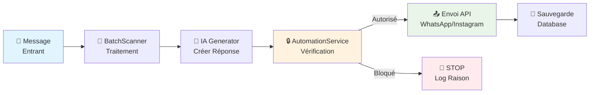

# 📚 Documentation SocialSync - Système d'Automation

## 🎯 Vue d'Ensemble

Le **Système d'Automation Intelligent** permet de contrôler précisément quand et comment l'IA répond automatiquement aux messages entrants sur WhatsApp et Instagram.

### ✨ Fonctionnalités Principales

- **🔘 Toggle par conversation** - Activer/désactiver l'IA conversation par conversation
- **📝 Filtrage par mots-clés** - L'IA ne répond que si certains mots sont présents
- **⚡ Contrôle instantané** - Vérification en temps réel (pas de file d'attente)
- **🎯 Scopes flexibles** - Règles globales, par compte ou par conversation
- **🔍 Matching avancé** - Support contains et regex

## 📖 Documentation

### 🚀 Pour Commencer
- **[Guide Rapide (5 min)](./AUTOMATION_QUICK_START.md)** - Démarrage express
- **[Documentation Technique Complète](./AUTOMATION_SYSTEM.md)** - Architecture et API détaillées

### 🏗️ Architecture

#### Pipeline de Traitement


#### Base de Données
- **Table `conversations`** : `automation_disabled BOOLEAN` (nouveau champ)
- **Table `automation_keyword_rules`** : Règles de mots-clés par scope

#### API Endpoints
```
📍 PATCH /api/automation/conversations/{id}/toggle
📍 POST  /api/automation/conversations/{id}/check  
📍 GET   /api/automation/keyword-rules
📍 POST  /api/automation/keyword-rules
📍 PATCH /api/automation/keyword-rules/{id}
📍 DELETE /api/automation/keyword-rules/{id}
```

## 🎯 Cas d'Usage

### 1. Désactiver IA pendant les heures de bureau
```json
PATCH /automation/conversations/{id}/toggle
{"enabled": false}
```

### 2. Support technique uniquement
```json
POST /automation/keyword-rules
{
  "scope_type": "user",
  "keywords": ["bug", "erreur", "problème", "help"],
  "description": "Support technique"
}
```

### 3. Urgences CEO
```json
POST /automation/keyword-rules
{
  "scope_type": "conversation",
  "scope_id": "conversation-ceo-uuid",
  "keywords": ["urgent", "emergency", "crisis"],
  "description": "Escalade direction"
}
```

## 🔧 Installation & Déploiement

### 1. Migration Base de Données
```bash
psql -d socialsync -f backend/migrations/add_automation_controls.sql
```

### 2. Redémarrage Backend
```bash
uvicorn app.main:app --reload --port 8000
```

### 3. Vérification
- **API Docs** : http://localhost:8000/docs#/Automation
- **Test** : `curl -X GET /api/automation/keyword-rules`

## 📊 Monitoring

### Logs Typiques
```
✅ Auto-réponse autorisée - Règles matchées: ["Support (ID: abc-123)"]
🚫 Auto-réponse bloquée - Raison: Automation désactivée
🚫 Auto-réponse bloquée - Raison: Aucune règle ne correspond
```

### Métriques Suggérées
- Taux de blocage par automation (%)
- Messages bloqués vs envoyés (timeline)
- Règles les plus utilisées
- Conversations avec automation désactivée

## 🛠️ Développement

### Structure des Services
```
backend/app/
├── services/
│   ├── automation_service.py      # 🆕 Service principal
│   └── batch_scanner.py           # ✏️ Modifié (intégration)
├── routers/
│   └── automation.py              # 🆕 Endpoints API
├── schemas/
│   └── automation.py              # 🆕 Types Pydantic
└── migrations/
    └── add_automation_controls.sql # 🆕 Migration BDD
```

### Tests Recommandés
```python
# Test toggle conversation
async def test_toggle_automation():
    result = await automation_service.toggle_conversation_automation(
        conversation_id="test-id",
        user_id="user-id", 
        enabled=False
    )
    assert result == True

# Test keyword matching
def test_message_matches_keywords():
    result = automation_service._message_matches_keywords(
        message="J'ai un problème urgent",
        keywords=["urgent", "problème"],
        match_type="contains"
    )
    assert result == True
```

## 🚀 Prochaines Étapes

### Phase 2 : Interface Frontend
- [ ] Dashboard des règles d'automation
- [ ] Toggle visuel par conversation
- [ ] Metrics et analytics

### Phase 3 : Webhooks Étendus
- [ ] Support commentaires Instagram/Facebook
- [ ] Mentions et tags
- [ ] Gestionnaire unifié d'événements

### Phase 4 : Règles Avancées
- [ ] Horaires de silence (9h-18h)
- [ ] Quotas par période
- [ ] Conditions complexes (ET/OU)
- [ ] Templates de réponse conditionnels

---

## 🤝 Contribution

Pour modifier ou étendre le système :

1. **Lire** la [documentation technique](./AUTOMATION_SYSTEM.md)
2. **Tester** avec le [guide rapide](./AUTOMATION_QUICK_START.md)  
3. **Développer** en suivant l'architecture existante
4. **Documenter** tes modifications

## 📞 Support

- **Issues** : Créer une issue GitHub avec les logs
- **Questions** : Documenter dans `docs/FAQ.md`
- **Améliorations** : Pull request avec tests

---

*📝 Documentation maintenue par l'équipe SocialSync - Dernière mise à jour: 2025-01-20*
