# 💬 DM Automation Feature

**AI-powered automated responses for Instagram DMs and WhatsApp messages using advanced RAG technology.**

[](https://github.com/yvankondjo/socialsync-ai)
[](https://www.langchain.com/)

---

## 📋 Overview

The DM Automation feature enables intelligent, context-aware responses to customer messages across Instagram and WhatsApp Business. Using Retrieval Augmented Generation (RAG) and LangGraph, the system can:

- 🤖 **Automatically respond** to customer inquiries
- 📚 **Reference knowledge base** for accurate answers
- 🎯 **Escalate complex issues** to human agents
- 🔄 **Learn from conversation history**
- ⚙️ **Customize responses** per conversation

---

## 🔄 Message Processing Flow

```mermaid
graph TD
    A[📱 Message Received<br/>Instagram/WhatsApp] --> B[🪝 Webhook Trigger]
    B --> C[💾 Store in Database<br/>conversations table]
    C --> D{🤖 AI Mode<br/>Enabled?}

    D -->|YES| E[🔍 Load Context<br/>Conversation History]
    D -->|NO| F[⏭️ Skip AI Processing]

    E --> G[🧠 RAG Agent Processing]
    G --> H[🔎 Vector Search<br/>Knowledge Base]
    H --> I[🛠️ Tool Execution<br/>escalation/search_knowledge]
    I --> J[💭 LLM Response<br/>Generation]
    J --> K[📤 Send Reply<br/>via Platform API]

    F --> L[👤 Manual Response<br/>Required]
    K --> M[✅ Response Sent]
    L --> M
```



---

## 🏗️ System Architecture

### Core Components

#### Message Processing Worker

**File:** `backend/app/workers/messages.py`

```python
@celery_app.task(bind=True)
def process_instagram_message(self, message_id: str):
    """
    Process incoming Instagram messages with AI automation.

    Steps:
    1. Load message and conversation context
    2. Check if AI mode is enabled for conversation
    3. If enabled: trigger RAG agent for response generation
    4. Send automated reply via Instagram Graph API
    5. Update conversation history and analytics
    """
    try:
        # Load message details
        message = get_message_by_id(message_id)

        # Check AI automation settings
        if message.conversation.ai_mode == "ON":
            # Generate AI response
            ai_response = rag_agent.generate_response(message)

            # Send via Instagram API
            instagram_api.send_message(
                recipient_id=message.sender_id,
                message_text=ai_response
            )
    except Exception as e:
        logger.error(f"Message processing failed: {e}")
        raise self.retry(countdown=60, max_retries=3)
```

#### RAG Agent Service

**File:** `backend/app/services/rag_agent.py`

**Key Features:**

- **LangGraph State Machine** - Orchestrates complex AI workflows
- **Multi-tool Integration** - Escalation, knowledge search, FAQ lookup
- **PostgreSQL Checkpoints** - Persistent conversation state
- **Context Window Management** - Efficient token usage

**Agent Capabilities:**

```python
class RAGAgent:
    def __init__(self):
        self.tools = [
            Tool(name="escalation", func=self.escalate_to_human),
            Tool(name="search_knowledge", func=self.search_kb),
            Tool(name="find_answers", func=self.query_faq)
        ]

    async def generate_response(self, message: Message) -> str:
        # 1. Load conversation history (last 10 messages)
        # 2. Vector search knowledge base for relevant context
        # 3. Execute appropriate tools based on message content
        # 4. Generate contextual response using LLM
        # 5. Apply safety filters and content guidelines
        pass
```

#### Message Polling System

**File:** `backend/app/workers/messages.py`

```python
@celery_app.task
def poll_instagram_messages():
    # Runs every 0.5s
    # Fetches new messages from Instagram Graph API
```

---

## 🎛️ Per-Conversation Control

### AI Mode Settings

**Database Schema:**

```sql
-- conversations table
CREATE TABLE conversations (
    id UUID PRIMARY KEY,
    user_id UUID REFERENCES auth.users(id),
    platform VARCHAR(50), -- 'instagram' or 'whatsapp'
    platform_conversation_id VARCHAR(255),
    ai_mode VARCHAR(10) DEFAULT 'ON', -- 'ON' or 'OFF'
    last_message_at TIMESTAMP,
    created_at TIMESTAMP DEFAULT NOW(),
    updated_at TIMESTAMP DEFAULT NOW()
);
```

### Frontend Controls

**Conversation Toggle:**

```typescript
// components/ConversationItem.tsx
function ConversationToggle({ conversationId, aiMode }) {
  const toggleAIMode = async () => {
    await api.updateConversation(conversationId, {
      ai_mode: aiMode === "ON" ? "OFF" : "ON",
    });
    // Refresh conversation list
    refreshConversations();
  };

  return (
    <Switch
      checked={aiMode === "ON"}
      onChange={toggleAIMode}
      label={aiMode === "ON" ? "🤖 AI Active" : "👤 Manual Only"}
    />
  );
}
```

**Backend API:**

```python
# routers/conversations.py
@router.patch("/{conversation_id}")
async def update_conversation(
    conversation_id: str,
    updates: ConversationUpdate,
    db: Session = Depends(get_db)
):
    conversation = db.query(Conversation).filter(
        Conversation.id == conversation_id
    ).first()

    if updates.ai_mode is not None:
        conversation.ai_mode = updates.ai_mode

    db.commit()
    return {"success": True}
```

---

## 🛠️ AI Agent Tools

### 1. Escalation Tool

**Purpose:** Transfer complex conversations to human agents

```python
@tool
def escalation(message: str, confidence: float, reason: str) -> str:
    """
    Escalate conversation to human support.

    Args:
        message: The customer message that triggered escalation
        confidence: AI confidence score (0.0-1.0)
        reason: Why this needs human intervention

    Actions:
    1. Create support_escalations record
    2. Set conversation.ai_mode = 'OFF'
    3. Send email notification to support team
    4. Update conversation status
    """
    # Create escalation record
    escalation_data = {
        "conversation_id": conversation.id,
        "message": message,
        "confidence": confidence,
        "reason": reason,
        "escalated_at": datetime.utcnow(),
        "status": "pending"
    }

    db.table("support_escalations").insert(escalation_data).execute()

    # Disable AI for this conversation
    db.table("conversations").update({
        "ai_mode": "OFF",
        "updated_at": datetime.utcnow()
    }).eq("id", conversation.id).execute()

    # Send notification
    email_service.send_escalation_notification(escalation_data)

    return "Conversation escalated to human support team."
```

**Trigger Keywords:**

- "human", "manager", "urgent", "speak to someone"
- "complaint", "problem", "issue"
- Low confidence scores (< 0.3)

### 2. Knowledge Search Tool

**Purpose:** Search knowledge base for relevant information

```python
@tool
def search_knowledge(query: str, top_k: int = 5) -> str:
    """
    Search knowledge base using hybrid retrieval (BM25 + vector similarity).

    Args:
        query: Search query from customer message
        top_k: Number of results to return

    Returns:
        Formatted string with relevant knowledge chunks
    """
    # Perform hybrid search
    results = retriever.retrieve_from_knowledge_chunks(
        query=query,
        k=top_k,
        search_type='hybrid'  # Combines BM25 + vector similarity
    )

    # Format results for LLM context
    formatted_results = []
    for result in results:
        formatted_results.append(f"""
        Source: {result['filename']}
        Relevance: {result['score']:.2f}
        Content: {result['content']}
        ---
        """)

    return "\n".join(formatted_results)
```

**Search Strategy:**

- **BM25** for keyword matching
- **Vector Similarity** for semantic understanding
- **Hybrid Scoring** combines both approaches
- **Re-ranking** for optimal relevance

### 3. FAQ Lookup Tool

**Purpose:** Find answers to frequently asked questions

```python
@tool
def find_answers(question: str) -> str:
    """
    Search FAQ database for direct question-answer pairs.

    Args:
        question: Customer question

    Returns:
        Structured answer if found, or search suggestions
    """
    # Search FAQ table
    faq_results = db.table("faq_qa").select("*").text_search(
        "question", question, config="english"
    ).limit(3).execute()

    if faq_results.data:
        # Return best matching FAQ
        best_match = faq_results.data[0]
        return f"""
        FAQ Answer:
        Q: {best_match['question']}
        A: {best_match['answer']}

        Confidence: {best_match.get('confidence', 'N/A')}
        """

    # No direct match found
    return "No direct FAQ match found. Consider using search_knowledge tool."
```

**FAQ Schema:**

```sql
CREATE TABLE faq_qa (
    id UUID PRIMARY KEY,
    question TEXT NOT NULL,
    answer TEXT NOT NULL,
    category VARCHAR(100),
    confidence FLOAT DEFAULT 1.0,
    created_at TIMESTAMP DEFAULT NOW()
);

-- Full-text search index
CREATE INDEX faq_question_search_idx ON faq_qa
USING GIN (to_tsvector('english', question));
```

---

## ⚙️ Configuration & Settings

### AI Settings Configuration

**Database Table:** `ai_settings`

```sql
CREATE TABLE ai_settings (
    id UUID PRIMARY KEY DEFAULT gen_random_uuid(),
    user_id UUID REFERENCES auth.users(id),
    ai_control_enabled BOOLEAN DEFAULT true,
    ai_enabled_for_chats BOOLEAN DEFAULT true,
    ai_model VARCHAR(100) DEFAULT 'gpt-4o',
    temperature DECIMAL(2,1) DEFAULT 0.7,
    system_prompt TEXT,
    max_tokens INTEGER DEFAULT 1000,
    flagged_keywords TEXT[] DEFAULT '{}',
    safety_mode VARCHAR(20) DEFAULT 'moderate',
    created_at TIMESTAMP DEFAULT NOW(),
    updated_at TIMESTAMP DEFAULT NOW(),

    UNIQUE(user_id)
);
```

### Default AI Configuration

```python
DEFAULT_AI_SETTINGS = {
    "ai_control_enabled": True,          # Master AI switch
    "ai_enabled_for_chats": True,        # Enable DM automation
    "ai_model": "gpt-4o",                 # Primary LLM model
    "temperature": 0.7,                  # Response creativity (0.0-1.0)
    "system_prompt": """
        You are a helpful customer support assistant for SocialSync AI.
        Provide accurate, friendly responses based on the knowledge base.
        If you're unsure about something, use the available tools to find information.
        Escalate to human support for complex issues or when customers specifically request it.
    """,
    "max_tokens": 1000,                  # Response length limit
    "flagged_keywords": [                 # Content filtering
        "spam", "scam", "inappropriate", "offensive"
    ],
    "safety_mode": "moderate"            # strict/moderate/permissive
}
```

### Safety & Content Filtering

**Safety Modes:**

- **strict**: Block any potentially risky content
- **moderate**: Allow most content, flag suspicious messages
- **permissive**: Minimal filtering, trust AI judgment

**Content Filtering Rules:**

```python
CONTENT_FILTERS = {
    "profanity": ["blocklist of inappropriate words"],
    "spam_patterns": ["regex patterns for spam detection"],
    "escalation_triggers": [
        "speak to manager", "human representative",
        "complaint", "refund", "cancel account"
    ]
}
```

---

## 📁 Key Files & Architecture

### Backend Components

| Component              | File                                         | Purpose                                 |
| ---------------------- | -------------------------------------------- | --------------------------------------- |
| **Message Worker**     | `backend/app/workers/messages.py`            | Real-time message polling & processing  |
| **RAG Agent**          | `backend/app/services/rag_agent.py`          | LangGraph-powered AI agent with tools   |
| **Automation Service** | `backend/app/services/automation_service.py` | Business logic for AI automation        |
| **Instagram Router**   | `backend/app/routers/instagram.py`           | Instagram Graph API integration         |
| **WhatsApp Router**    | `backend/app/routers/whatsapp.py`            | WhatsApp Business API integration       |
| **System Prompt**      | `backend/app/deps/system_prompt.py`          | AI personality & behavior configuration |

### Frontend Components

| Component             | File                                       | Purpose                         |
| --------------------- | ------------------------------------------ | ------------------------------- |
| **Inbox Page**        | `frontend/app/inbox/page.tsx`              | Unified conversation management |
| **Conversation Item** | `frontend/components/ConversationItem.tsx` | Individual conversation display |
| **AI Toggle**         | `frontend/components/AIToggle.tsx`         | Per-conversation AI control     |
| **Message Composer**  | `frontend/components/MessageComposer.tsx`  | Manual response interface       |

### Database Tables

| Table                 | Purpose                                |
| --------------------- | -------------------------------------- |
| `conversations`       | Message threads & AI mode settings     |
| `messages`            | Individual messages from all platforms |
| `ai_settings`         | User AI configuration & preferences    |
| `support_escalations` | Human intervention requests            |
| `knowledge_base`      | Document chunks for RAG                |
| `faq_qa`              | Frequently asked questions             |

---

## 📊 Monitoring & Analytics

### AI Performance Metrics

```python
AI_METRICS = {
    "response_time": "Average AI response generation time",
    "escalation_rate": "Percentage of conversations escalated to humans",
    "customer_satisfaction": "Post-interaction satisfaction scores",
    "accuracy_score": "AI response accuracy based on human review",
    "usage_cost": "Monthly AI API costs by provider"
}
```

### Real-time Dashboards

**AI Performance Dashboard:**

- Response time trends
- Escalation rate by topic
- Customer satisfaction scores
- Cost per conversation
- Model performance comparison

**Conversation Analytics:**

- Total conversations handled by AI
- Average resolution time
- Peak usage hours
- Platform distribution (Instagram vs WhatsApp)

---

## 🔧 Troubleshooting

### Common Issues

**AI Not Responding:**

```bash
# Check Celery worker status
docker-compose logs celery

# Verify AI settings
curl http://localhost:8000/api/ai/settings

# Check conversation AI mode
curl http://localhost:8000/api/conversations/{id}
```

**High Escalation Rate:**

- Review AI confidence thresholds
- Check knowledge base completeness
- Analyze common escalation topics
- Consider model fine-tuning

**Slow Response Times:**

- Monitor API rate limits
- Check vector search performance
- Optimize knowledge base chunking
- Consider model caching

---

## 🚀 Future Enhancements

### Planned Features

- **Multi-language Support** - Automatic language detection and translation
- **Sentiment Analysis** - Enhanced conversation understanding
- **Proactive Engagement** - AI-initiated conversations based on triggers
- **Voice Message Support** - Audio transcription and response
- **Advanced Analytics** - Conversation topic modeling and trends

### Performance Optimizations

- **Response Caching** - Cache similar queries and responses
- **Model Distillation** - Smaller, faster models for common queries
- **Batch Processing** - Process multiple messages simultaneously
- **Edge Deployment** - Run AI models closer to users

---

## 📚 Related Documentation

- **[Installation Guide](INSTALLATION.md)** - Complete setup instructions
- **[Knowledge Base Setup](KNOWLEDGE_BASE.md)** - Training the AI
- **[API Reference](../technical/API.md)** - Technical API details
- **[Troubleshooting Guide](../technical/TROUBLESHOOTING.md)** - Common issues & solutions

---

**Last Updated:** 2025-10-30
**Version:** 1.0.0
**Status:** ✅ Production Ready
