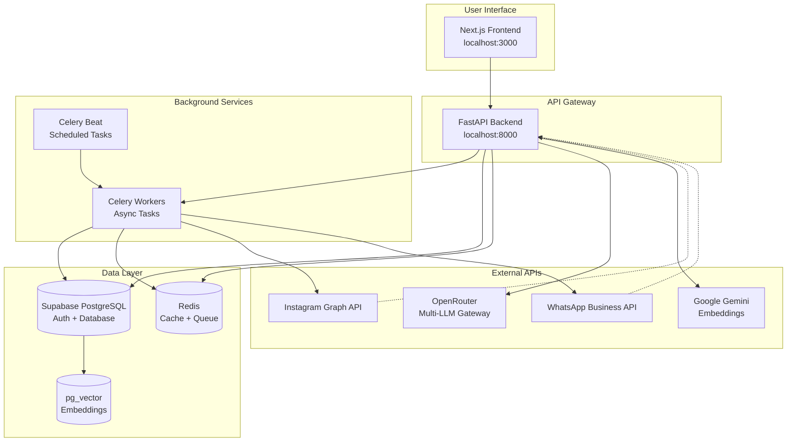
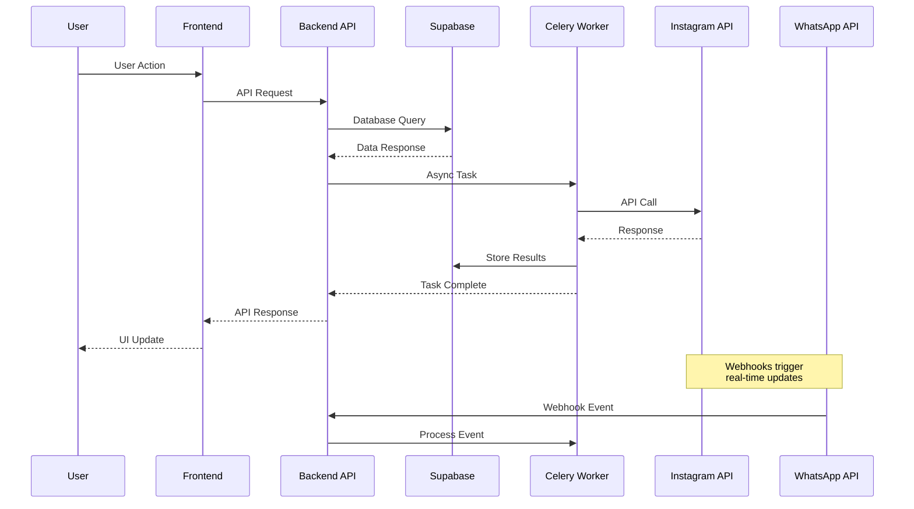
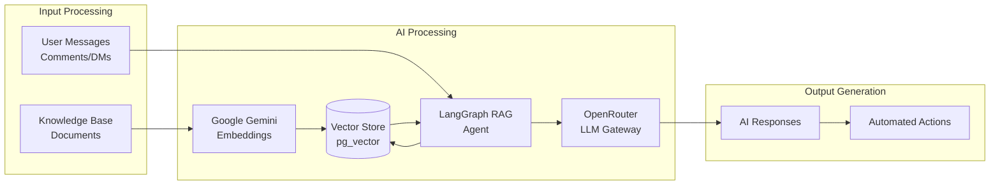
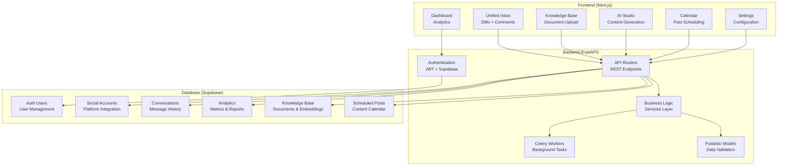

# Architecture Diagrams

## System Architecture Overview

```mermaid
graph TB
    subgraph "User Interface"
        UI[Next.js Frontend<br/>localhost:3000]
    end

    subgraph "API Gateway"
        API[FastAPI Backend<br/>localhost:8000]
    end

    subgraph "Background Services"
        CELERY[Celery Workers<br/>Async Tasks]
        BEAT[Celery Beat<br/>Scheduled Tasks]
    end

    subgraph "Data Layer"
        SUPABASE[(Supabase PostgreSQL<br/>Auth + Database)]
        REDIS[(Redis<br/>Cache + Queue)]
        VECTORS[(pg_vector<br/>Embeddings)]
    end

    subgraph "External APIs"
        INSTAGRAM[Instagram Graph API]
        WHATSAPP[WhatsApp Business API]
        OPENROUTER[OpenRouter<br/>Multi-LLM Gateway]
        GOOGLE[Google Gemini<br/>Embeddings]
    end

    UI --> API
    API --> CELERY
    API --> SUPABASE
    API --> REDIS

    CELERY --> SUPABASE
    CELERY --> REDIS
    CELERY --> INSTAGRAM
    CELERY --> WHATSAPP

    BEAT --> CELERY

    SUPABASE --> VECTORS

    API --> OPENROUTER
    API --> GOOGLE

    INSTAGRAM -.-> API
    WHATSAPP -.-> API
```

## Data Flow Architecture

```mermaid
sequenceDiagram
    participant U as User
    participant FE as Frontend
    participant BE as Backend API
    participant SB as Supabase
    participant CE as Celery Worker
    participant IG as Instagram API
    participant WA as WhatsApp API

    U->>FE: User Action
    FE->>BE: API Request
    BE->>SB: Database Query
    SB-->>BE: Data Response

    BE->>CE: Async Task
    CE->>IG: API Call
    IG-->>CE: Response
    CE->>SB: Store Results
    CE-->>BE: Task Complete

    BE-->>FE: API Response
    FE-->>U: UI Update

    Note over IG,WA: Webhooks trigger<br/>real-time updates
    WA->>BE: Webhook Event
    BE->>CE: Process Event
```

## AI Pipeline Architecture

```mermaid
graph LR
    subgraph "Input Processing"
        DOCS[Knowledge Base<br/>Documents]
        MSGS[User Messages<br/>Comments/DMs]
    end

    subgraph "AI Processing"
        EMB[Google Gemini<br/>Embeddings]
        VEC[(Vector Store<br/>pg_vector)]
        RAG[LangGraph RAG<br/>Agent]
        LLM[OpenRouter<br/>LLM Gateway]
    end

    subgraph "Output Generation"
        RESP[AI Responses]
        ACTIONS[Automated Actions]
    end

    DOCS --> EMB
    EMB --> VEC
    MSGS --> RAG
    RAG --> VEC
    VEC --> RAG
    RAG --> LLM
    LLM --> RESP
    RESP --> ACTIONS
```

## Component Architecture

```mermaid
graph TD
    subgraph "Frontend (Next.js)"
        DASH[Dashboard<br/>Analytics]
        INBOX[Unified Inbox<br/>DMs + Comments]
        KB[Knowledge Base<br/>Document Upload]
        AI_STUDIO[AI Studio<br/>Content Generation]
        CALENDAR[Calendar<br/>Post Scheduling]
        SETTINGS[Settings<br/>Configuration]
    end

    subgraph "Backend (FastAPI)"
        AUTH[Authentication<br/>JWT + Supabase]
        ROUTERS[API Routers<br/>REST Endpoints]
        SERVICES[Business Logic<br/>Services Layer]
        WORKERS[Celery Workers<br/>Background Tasks]
        SCHEMAS[Pydantic Models<br/>Data Validation]
    end

    subgraph "Database (Supabase)"
        AUTH_USERS[Auth Users<br/>User Management]
        SOCIAL_ACCOUNTS[Social Accounts<br/>Platform Integration]
        CONVERSATIONS[Conversations<br/>Message History]
        ANALYTICS[Analytics<br/>Metrics & Reports]
        KB_DOCS[Knowledge Base<br/>Documents & Embeddings]
        SCHEDULED_POSTS[Scheduled Posts<br/>Content Calendar]
    end

    DASH --> AUTH
    INBOX --> ROUTERS
    KB --> ROUTERS
    AI_STUDIO --> ROUTERS
    CALENDAR --> ROUTERS
    SETTINGS --> ROUTERS

    ROUTERS --> SERVICES
    SERVICES --> WORKERS
    SERVICES --> SCHEMAS

    AUTH --> AUTH_USERS
    ROUTERS --> SOCIAL_ACCOUNTS
    ROUTERS --> CONVERSATIONS
    ROUTERS --> ANALYTICS
    ROUTERS --> KB_DOCS
    ROUTERS --> SCHEDULED_POSTS
```
